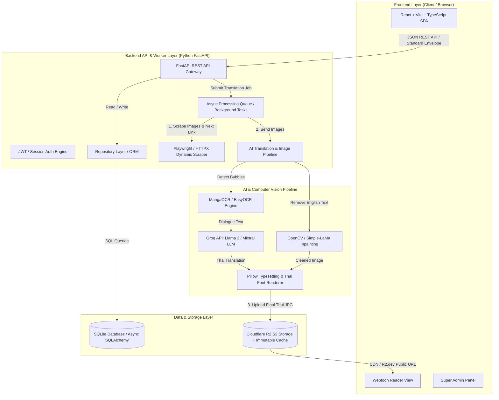
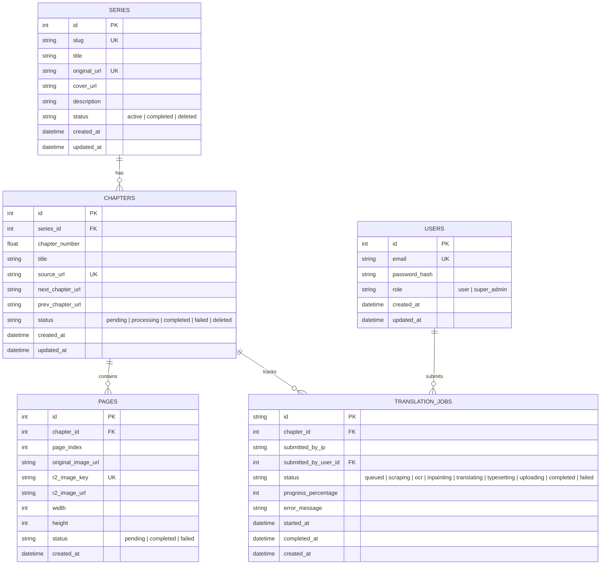
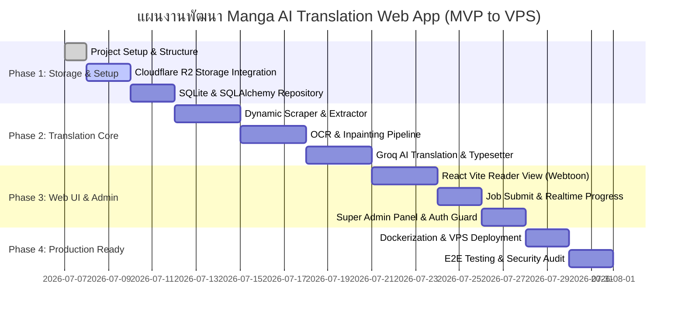

# พิมพ์เขียวแผนงานและสถาปัตยกรรมระบบ: Manga/Manhua AI Translation Web Application
**Project Plan & Architectural Blueprint (MVP Prototype & VPS Scalable)**

---

## 1. Executive Summary & Project Goals (บทสรุปผู้บริหารและเป้าหมายโครงการ)

โครงการ **Manga/Manhua AI Translation Web Application** คือระบบเว็บแอปพลิเคชันสำหรับแปลการ์ตูนมังงะและมังฮวาจากภาษาอังกฤษเป็นภาษาไทยโดยอัตโนมัติด้วยปัญญาประดิษฐ์ (AI) โดยมีเป้าหมายในการสร้างประสบการณ์การอ่านการ์ตูนแปลไทยที่ลื่นไหล เป็นธรรมชาติ และเกลาสำนวนเสมือนคนแปลจริง พร้อมทั้งคำนึงถึงต้นทุนการดำเนินงาน ประสิทธิภาพในการจัดเก็บข้อมูล และความปลอดภัยสูงสุดตามหลักการ Everything Claude Code (ECC)

### 1.1 หลักการหัวใจสำคัญ (Core Concepts)
- **"คนแรกสั่งแปล คนต่อไปอ่านฟรี" (First Person Translates, Next Readers Read Free):** 
  เมื่อผู้ใช้คนแรกส่งลิงก์การ์ตูนภาษาอังกฤษเข้ามาในระบบ ระบบจะทำงานผ่าน Pipeline อัตโนมัติ (ขูดข้อมูล -> แกะข้อความ -> ลบตัวอักษร -> แปลด้วย AI -> ฝังข้อความไทย -> อัปโหลดขึ้นคลัง) จากนั้นจะบันทึกผลลัพธ์ถาวรลงในฐานข้อมูลและ Cloud Storage เมื่อผู้อ่านคนถัดไปเข้ามาอ่านตอนเดียวกัน ระบบจะดึงรูปภาพที่แปลเสร็จแล้วจากคลังข้อมูลและ Cache ทันที โดยไม่เกิดการเรียกใช้ API หรือประมวลผลซ้ำ ทำให้ประหยัดต้นทุน AI 100% สำหรับการอ่านครั้งถัดไป
- **คุณภาพการแปลระดับมนุษย์ (Human-Like Translation Quality):**
  ใช้โมเดลภาษาขนาดใหญ่ (LLM) ผ่าน **Groq API (Llama 3 / Mixtral)** พร้อม Custom Prompt ที่ออกแบบมาเป็นพิเศษเพื่อปรับบริบทและคำสแลงให้เข้ากับสไตล์การอ่านเว็บตูนไทย
- **ระบบนำทางต่อเนื่องอัจฉริยะ (Dynamic Scraper & Next Chapter Navigation):**
  ตัวขูดข้อมูลไม่เพียงดึงเฉพาะรูปภาพของตอนปัจจุบัน แต่จะวิเคราะห์และดึงลิงก์ของ "ตอนถัดไป (Next Chapter)" และ "ตอนก่อนหน้า (Prev Chapter)" มาเก็บไว้ในระบบด้วย ทำให้ผู้อ่านสามารถกดปุ่ม "ตอนต่อไป" ได้ทันทีโดยไม่ต้องไปหาลิงก์ใหม่จากเว็บต้นทาง
- **การจัดเก็บและแคชที่มีประสิทธิภาพสูงสุด (Immutable Cloud Storage & Browser Cache):**
  จัดเก็บรูปภาพแปลไทยบน **Cloudflare R2 (S3-Compatible)** ที่ไม่มีค่าใช้จ่าย Egress Bandwidth พร้อมฝัง HTTP Header คำสั่งควบคุมแคชบนเบราว์เซอร์ `public, max-age=86400, immutable` เพื่อประหยัดพื้นที่และเซฟโควตา Class B Operations

---

## 2. System Architecture & Tech Stack Selection (สถาปัตยกรรมระบบและการเลือกเทคโนโลยี)

จากการวิเคราะห์ความต้องการเชิงเทคนิคใน Blueprint (ภาพดิบ, การประมวลผล OCR, Inpainting ลบข้อความ, AI Translation, Typesetting ฝังฟอนต์ไทย และ API Web Server) เราได้ทำการประเมินข้อดีข้อเสียของแต่ละภาษาและเลือก Stack ที่เหมาะสมที่สุดสำหรับการประมวลผลรูปภาพและการสร้าง API



### 2.1 การตัดสินใจเลือก Tech Stack (Tech Stack Justification)

| ส่วนประกอบ (Layer) | เทคโนโลยีที่เลือก (Selected Tech) | เหตุผลในการเลือก (Why Chosen & Comparative Analysis) |
| :--- | :--- | :--- |
| **Backend API & Processing Engine** | **Python 3.11+ (FastAPI + AsyncIO)** | **เหตุผลสำคัญ:** Python เป็นภาษามาตรฐานอันดับหนึ่ง (Industry Standard) สำหรับ Computer Vision และ AI Machine Learning การใช้ Node.js/Express สำหรับงาน OCR และ Image Inpainting จะต้องพึ่งพา Child Process เรียก Python หรือ WASM ที่ช้าและจัดการ Memory ยาก การใช้ **FastAPI** ทำให้เราสร้าง REST API ที่รองรับ Asynchronous I/O ความเร็วสูงเทียบเท่า Node.js ในขณะที่ทำงานร่วมกับไลบรารีจัดการภาพ (`numpy`, `opencv`, `Pillow`, `manga-ocr`) ได้แบบ Native ในกระบวนการเดียว |
| **Frontend Web Application** | **React 18 + Vite + TypeScript + Tailwind CSS** | ให้การพัฒนาหน้าจอ SPA (Single Page Application) ที่รวดเร็ว แยกขาดจาก Backend อย่างสมบูรณ์ (Decoupled Architecture) ทำให้ในอนาคตสามารถนำ Frontend ไปโฮสต์บน Cloudflare Pages หรือ Vercel ได้ทันที พร้อมการแสดงผล Reader View สไตล์ Webtoon แนวนอน/แนวตั้งที่ลื่นไหล |
| **Database & ORM** | **SQLite + SQLAlchemy 2.0 (Async) + Alembic** | **SQLite** เป็นฐานข้อมูลแบบ Zero-Configuration ที่เร็วและเหมาะที่สุดสำหรับ Local MVP ตาม Blueprint เมื่อใช้งานร่วมกับ **SQLAlchemy 2.0 (Async)** และหลักการ **Repository Pattern** หากในอนาคตต้องการสเกลขึ้น VPS หรือ Cloud ก็สามารถเปลี่ยน Connection String ไปใช้ **PostgreSQL** หรือ **Supabase** ได้ทันทีโดยไม่ต้องแก้ไข Logic หรือ Query แม้แต่บรรทัดเดียว |
| **Storage & Caching** | **Cloudflare R2 (boto3 / aioboto3)** | รองรับ S3 API มาตรฐาน ไม่มีค่าใช้จ่าย Egress (Bandwidth ฟรี) เหมาะสำหรับการโหลดรูปมังฮวาที่มีขนาดใหญ่ พร้อมการฝัง Custom Header `Cache-Control: public, max-age=86400, immutable` ขณะอัปโหลด |
| **AI Translation Brain** | **Groq API (Llama-3.3-70b-versatile / Mixtral-8x7b)** | ให้ความเร็วในการประมวลผล (Token per second) สูงที่สุดในปัจจุบัน ค่าใช้จ่ายต่ำและมีความฉลาดเพียงพอในการแปลภาษาและปรับบริบทคำสแลงการ์ตูนไทยผ่าน System Prompt |
| **Web Scraping & Crawler** | **Playwright (Python Async) + HTTPX + BeautifulSoup4** | **Playwright** รองรับการดึงข้อมูลจากหน้าเว็บแบบไดนามิก (JavaScript-heavy/SPA) สามารถจำลอง Browser เพื่อเลี่ยง Block และดึงปุ่ม "Next Chapter Link" ได้อย่างแม่นยำ พร้อมโครงสร้าง Modular Adapter สำหรับขูดจากแหล่งต่างๆ สไตล์ Tachiyomi/Mihon |
| **Computer Vision Pipeline** | **MangaOCR + OpenCV / Simple-LaMa + Pillow** | - **MangaOCR/EasyOCR:** แม่นยำสูงในการแกะข้อความในกล่องคำพูดการ์ตูน (Speech Bubbles)<br>- **OpenCV / LaMa:** ถมขาวหรือลบพื้นหลังกล่องคำพูดเดิมได้อย่างเนียนเรียบ<br>- **Pillow (PIL):** เรนเดอร์ข้อความไทยลงในกล่องพิกัดเดิม พร้อมคำนวณการตัดคำ (Word Wrap) และขนาดฟอนต์อัตโนมัติด้วยฟอนต์การ์ตูนไทย (เช่น Prompt, Sarabun, SOV) |

---

## 3. Complete Directory & Modular File Structure (โครงสร้างโฟลเดอร์และไฟล์แบบโมดูลาร์)

โครงสร้างโปรเจกต์ถูกออกแบบตามหลักการ **High Cohesion, Low Coupling**, การแบ่งกลุ่มตามฟังก์ชันการทำงาน (Feature/Domain-driven), ขนาดไฟล์เล็กและอ่านง่าย (เฉลี่ยไม่เกิน 200-400 บรรทัด, สูงสุดไม่เกิน 800 บรรทัด) และปฏิบัติตาม **Repository Pattern** อย่างเคร่งครัด

```
manhwabkk/
├── PROJECT_PLAN.md                # แผนงานและสถาปัตยกรรมระบบโดยละเอียด
├── CHANGELOG.md                   # บันทึกประวัติการเปลี่ยนแปลงตามกฎไฟลต์บังคับของระบบ
├── README.md                      # คู่มือการติดตั้งและรันระบบ Local MVP
├── .env.example                   # ตัวอย่างตัวแปรสภาพแวดล้อม (ห้าม Hardcode สรุปค่าในโค้ดเด็ดขาด)
├── .gitignore                     # กฎการยกเว้นไฟล์ของ Git
│
├── backend/                       # Backend Processing Engine & API Gateway (Python FastAPI)
│   ├── pyproject.toml             # กฎและรายการ Library ขึ้นต่อกัน (Dependencies via Poetry / PIP)
│   ├── requirements.txt           # รายการ PIP Dependencies สำรอง
│   ├── alembic.ini                # การตั้งค่า Alembic Database Migrations
│   ├── alembic/                   # โฟลเดอร์เก็บไฟล์ประวัติ Migration ของฐานข้อมูล
│   │   └── versions/
│   │
│   └── src/                       # Source Code ของ Backend
│       ├── __init__.py
│       ├── main.py                # จุดเริ่มต้นแอปพลิเคชัน FastAPI, Middleware, CORS, Exception Handlers
│       ├── config.py              # โหลดการตั้งค่าจาก .env ผ่าน Pydantic Settings พร้อม Validate ค่า
│       ├── database.py            # Async SQLAlchemy Engine, SessionMaker และ Base Model
│       │
│       ├── common/                # ยูทิลิตี้และคลาสส่วนกลาง
│       │   ├── __init__.py
│       │   ├── envelope.py        # API Response Envelope Formatting (success, data, error, meta)
│       │   ├── exceptions.py      # Custom Domain Exceptions & Error Handling
│       │   ├── security.py        # Password Hashing (Bcrypt) และ JWT Token Management
│       │   └── repository.py      # Abstract Base Repository Pattern Interface (IRepository)
│       │
│       ├── domains/               # โมดูลตามโดเมนธุรกิจ (Domain-Driven Organization)
│       │   ├── __init__.py
│       │   │
│       │   ├── auth/              # โดเมนระบบจัดการผู้ใช้และการยืนยันตัวตน (Super Admin Auth)
│       │   │   ├── __init__.py
│       │   │   ├── models.py      # SQLAlchemy User Model
│       │   │   ├── schemas.py     # Pydantic Schemas (LoginReq, UserRes, TokenRes)
│       │   │   ├── repository.py  # UserRepository (สืบทอดจาก Base Repository)
│       │   │   ├── service.py     # AuthService Business Logic (Authenticate, Create Admin)
│       │   │   ├── dependencies.py# FastAPI Auth Guard / Permission Checker (super_admin only)
│       │   │   └── router.py      # Auth Endpoints (/api/v1/auth/*)
│       │   │
│       │   ├── manga/             # โดเมนจัดการข้อมูลเรื่องการ์ตูน (Series), ตอน (Chapters), และหน้า (Pages)
│       │   │   ├── __init__.py
│       │   │   ├── models.py      # SQLAlchemy Models: Series, Chapter, Page
│       │   │   ├── schemas.py     # Pydantic Schemas สำหรับ Manga, Chapters, Pages
│       │   │   ├── repository.py  # SeriesRepository, ChapterRepository, PageRepository
│       │   │   ├── service.py     # MangaService (CRUD, Check Chapter Cache, Navigation Links)
│       │   │   └── router.py      # Manga Endpoints (/api/v1/series/*)
│       │   │
│       │   └── jobs/              # โดเมนจัดการคิวและสถานะงานแปลภาษา (Translation Jobs)
│       │       ├── __init__.py
│       │       ├── models.py      # SQLAlchemy Model: TranslationJob
│       │       ├── schemas.py     # Pydantic Schemas: JobSubmitReq, JobStatusRes
│       │       ├── repository.py  # JobRepository
│       │       ├── service.py     # JobService (Create Job, Update Progress, Background Dispatcher)
│       │       └── router.py      # Job Endpoints (/api/v1/jobs/*)
│       │
│       ├── infrastructure/        # การเชื่อมต่อระบบภายนอก (External Integrations)
│       │   ├── __init__.py
│       │   │
│       │   ├── storage/           # โมดูลจัดการ Cloudflare R2 Storage
│       │   │   ├── __init__.py
│       │   │   ├── r2_client.py   # aioboto3 S3 Client wrapper
│       │   │   └── r2_service.py  # ฟังก์ชัน Upload พร้อม Immutable Cache Header, Delete File/Folder
│       │   │
│       │   ├── scraper/           # โมดูลขูดข้อมูลรูปภาพและลิงก์ตอนถัดไป
│       │   │   ├── __init__.py
│       │   │   ├── base_scraper.py# Abstract Scraper Interface
│       │   │   ├── playwright_engine.py # Playwright Headless Browser Wrapper
│       │   │   └── extractors/    # ปลั๊กอินรองรับเว็บต่างๆ สไตล์ Tachiyomi/Mihon
│       │   │       ├── __init__.py
│       │   │       └── generic_extractor.py # Extractor พื้นฐานสำหรับเว็บอ่านมังงะทั่วไป
│       │   │
│       │   └── ai/                # โมดูลเชื่อมต่อ Groq API LLM
│       │       ├── __init__.py
│       │       ├── groq_client.py # Groq Async Client Wrapper
│       │       └── translator.py  # Prompt Engineering & Manga Slang Adaptation Logic
│       │
│       └── pipeline/              # Core AI Translation & Computer Vision Pipeline Worker
│           ├── __init__.py
│           ├── ocr_engine.py      # ตรวจจับตำแหน่งกล่องคำพูดและแกะข้อความ (MangaOCR / EasyOCR)
│           ├── inpainter.py       # ลบข้อความอังกฤษเดิมและถมพื้นหลังกล่อง (OpenCV / Simple-LaMa)
│           ├── typesetter.py      # เรนเดอร์ฟอนต์ไทยลงในพิกัดเดิม พร้อมคำนวณ Word Wrap
│           └── orchestrator.py    # ร้อยเรียงกระบวนการ: Scrape -> OCR -> Inpaint -> Translate -> Typeset -> R2 Upload
│
├── frontend/                      # Web User Interface & Admin Dashboard (React + Vite + TS)
│   ├── package.json
│   ├── tsconfig.json
│   ├── vite.config.ts
│   ├── tailwind.config.js
│   ├── index.html
│   ├── public/                    # Static Assets & Fonts
│   └── src/
│       ├── main.tsx               # Entry point
│       ├── App.tsx                # App Routing & Providers
│       ├── index.css              # Tailwind Base Styles
│       │
│       ├── types/                 # TypeScript Interfaces (API Responses, Manga, Job)
│       │   ├── api.ts             # Envelope Standard Interface
│       │   ├── manga.ts
│       │   └── auth.ts
│       │
│       ├── services/              # API Client Layer (Axios / Fetch Wrappers)
│       │   ├── client.ts          # Axios instance พร้อม Base URL และ Interceptors
│       │   ├── auth.service.ts
│       │   ├── manga.service.ts
│       │   └── job.service.ts
│       │
│       ├── context/               # React Context / State Management
│       │   └── AuthContext.tsx    # จัดการสถานะ Super Admin Login
│       │
│       ├── components/            # UI Components ส่วนกลาง
│       │   ├── common/            # Navbar, Button, Modal, LoadingSpinner, Alert
│       │   ├── layout/            # MainLayout, AdminLayout (Responsive Mobile & Desktop)
│       │   └── ads/               # Monetization Ad Components (AdSlot, BannerAd, SidebarAd)
│       │
│       ├── features/              # Components แยกตามคุณสมบัติ (Feature-based)
│       │   ├── reader/            # หน้าจอนักอ่าน (Reader View)
│       │   │   ├── WebtoonViewer.tsx  # Scroll แนวดิ่ง ลื่นไหล โหลดภาพจาก R2
│       │   │   ├── ReaderNav.tsx      # ปุ่ม Next Chapter / Prev Chapter อัตโนมัติ
│       │   │   └── ChapterHeader.tsx  # ชื่อเรื่องและตอนปัจจุบัน
│       │   │
│       │   ├── submit/            # หน้าจอส่งลิงก์แปลภาษา (Translation Job Submission)
│       │   │   ├── SubmitForm.tsx     # ฟอร์มวาง URL ภาษาอังกฤษ
│       │   │   └── JobProgress.tsx    # แสดงแถบ Progress และสถานะเรียลไทม์ (Polling / SSE)
│       │   │
│       │   ├── admin/             # หน้าจอควบคุมสำหรับ Super Admin
│       │   │   ├── AdminLogin.tsx     # ระบบเข้าสู่ระบบด้วย Email / Password
│       │   │   ├── SeriesList.tsx     # รายการมังงะในคลัง
│       │   │   ├── ChapterManager.tsx # ปุ่มลบตอน / ลบเรื่อง (Protected Action)
│       │   │   └── JobDashboard.tsx   # มอนิเตอร์งานแปลทั้งหมดในระบบ
│       │   │
│       │   └── catalog/           # หน้าจอรวมรายการเรื่องการ์ตูนที่แปลแล้วในระบบ
│       │       ├── MangaGrid.tsx
│       │       └── MangaDetail.tsx
│       │
│       └── utils/                 # ฟังก์ชันเสริมและ Helpers
│           └── formatters.ts
│
├── storage_fonts/                 # โฟลเดอร์เก็บไฟล์ฟอนต์ภาษาไทยสำหรับการลงตัวอักษร (Typesetting)
│   ├── Prompt-Medium.ttf
│   ├── Sarabun-Regular.ttf
│   └── SOV_MangaThai.ttf
│
└── docker/                        # Docker & VPS Deployment Configurations
    ├── Dockerfile.backend
    ├── Dockerfile.frontend
    └── docker-compose.yml         # สำหรับรัน Local ทั้งระบบในคำสั่งเดียวเมื่อพัฒนาเสร็จ
```

### 3.1 Repository Pattern Implementation (ตัวอย่างโครงสร้าง Repository Pattern)

เพื่อรับประกันกฎ **Immutability & Code Quality** ของ ECC เราจะแยกชั้นการเข้าถึงข้อมูล (Data Access Layer) ออกจากชั้นตรรกะทางธุรกิจ (Business Logic Layer) โดยสมบูรณ์

```python
# src/common/repository.py - Abstract Base Repository Interface
from abc import ABC, abstractmethod
from typing import Generic, TypeVar, Optional, List, Any

T = TypeVar("T")

class IRepository(ABC, Generic[T]):
    @abstractmethod
    async def find_all(self, skip: int = 0, limit: int = 100, **filters: Any) -> List[T]:
        pass

    @abstractmethod
    async def find_by_id(self, entity_id: Any) -> Optional[T]:
        pass

    @abstractmethod
    async def create(self, data: dict) -> T:
        pass

    @abstractmethod
    async def update(self, entity_id: Any, data: dict) -> Optional[T]:
        pass

    @abstractmethod
    async def delete(self, entity_id: Any) -> bool:
        pass
```

---

## 4. Database Schema (SQLite Database Design)

ระบบใช้ฐานข้อมูล SQLite ในช่วง Local MVP โดยใช้ **SQLAlchemy 2.0 (Async)** เป็น ORM และจัดการโครงสร้างด้วย **Alembic** การออกแบบตารางถูกทำให้สอดคล้องกับมาตรฐาน NF3 รองรับคลังข้อมูลการ์ตูน, หน้าการ์ตูนแต่ละหน้า, การสืบค้นรวดเร็วด้วย Index, และการจัดการคิวแปลภาษา

### 4.1 Entity Relationship Diagram (ERD)



### 4.2 SQL DDL (Table Definitions)

```sql
-- 1. ตารางผู้ใช้งานและสิทธิ์ (Users Table)
CREATE TABLE IF NOT EXISTS users (
    id INTEGER PRIMARY KEY AUTOINCREMENT,
    email VARCHAR(255) NOT NULL UNIQUE,
    password_hash VARCHAR(255) NOT NULL,
    role VARCHAR(50) NOT NULL DEFAULT 'user', -- 'user', 'super_admin'
    created_at TIMESTAMP NOT NULL DEFAULT CURRENT_TIMESTAMP,
    updated_at TIMESTAMP NOT NULL DEFAULT CURRENT_TIMESTAMP
);
CREATE INDEX idx_users_email ON users(email);
CREATE INDEX idx_users_role ON users(role);

-- 2. ตารางเรื่องมังงะ/มังฮวา (Series Table)
CREATE TABLE IF NOT EXISTS series (
    id INTEGER PRIMARY KEY AUTOINCREMENT,
    slug VARCHAR(255) NOT NULL UNIQUE,
    title VARCHAR(500) NOT NULL,
    original_url VARCHAR(1024) NOT NULL UNIQUE,
    cover_url VARCHAR(1024),
    description TEXT,
    status VARCHAR(50) NOT NULL DEFAULT 'active', -- 'active', 'completed', 'deleted'
    created_at TIMESTAMP NOT NULL DEFAULT CURRENT_TIMESTAMP,
    updated_at TIMESTAMP NOT NULL DEFAULT CURRENT_TIMESTAMP
);
CREATE INDEX idx_series_slug ON series(slug);
CREATE INDEX idx_series_original_url ON series(original_url);

-- 3. ตารางตอนของการ์ตูน (Chapters Table)
CREATE TABLE IF NOT EXISTS chapters (
    id INTEGER PRIMARY KEY AUTOINCREMENT,
    series_id INTEGER NOT NULL,
    chapter_number REAL NOT NULL, -- รองรับตอนย่อย เช่น 10.5
    title VARCHAR(500),
    source_url VARCHAR(1024) NOT NULL UNIQUE,
    next_chapter_url VARCHAR(1024), -- ลิงก์สำหรับระบบ Dynamic Next Button
    prev_chapter_url VARCHAR(1024),
    status VARCHAR(50) NOT NULL DEFAULT 'pending', -- 'pending', 'processing', 'completed', 'failed', 'deleted'
    created_at TIMESTAMP NOT NULL DEFAULT CURRENT_TIMESTAMP,
    updated_at TIMESTAMP NOT NULL DEFAULT CURRENT_TIMESTAMP,
    FOREIGN KEY (series_id) REFERENCES series(id) ON DELETE CASCADE,
    UNIQUE(series_id, chapter_number)
);
CREATE INDEX idx_chapters_series_id ON chapters(series_id);
CREATE INDEX idx_chapters_source_url ON chapters(source_url);
CREATE INDEX idx_chapters_status ON chapters(status);

-- 4. ตารางรูปภาพแต่ละหน้า (Pages Table)
CREATE TABLE IF NOT EXISTS pages (
    id INTEGER PRIMARY KEY AUTOINCREMENT,
    chapter_id INTEGER NOT NULL,
    page_index INTEGER NOT NULL, -- ลำดับหน้า 1, 2, 3...
    original_image_url VARCHAR(1024) NOT NULL,
    r2_image_key VARCHAR(1024) NOT NULL UNIQUE, -- Path ใน R2 Bucket
    r2_image_url VARCHAR(1024) NOT NULL, -- Public URL สำหรับ Frontend
    width INTEGER DEFAULT 0,
    height INTEGER DEFAULT 0,
    status VARCHAR(50) NOT NULL DEFAULT 'pending',
    created_at TIMESTAMP NOT NULL DEFAULT CURRENT_TIMESTAMP,
    FOREIGN KEY (chapter_id) REFERENCES chapters(id) ON DELETE CASCADE,
    UNIQUE(chapter_id, page_index)
);
CREATE INDEX idx_pages_chapter_id ON pages(chapter_id);
CREATE INDEX idx_pages_r2_key ON pages(r2_image_key);

-- 5. ตารางคิวงานแปลภาษาและสถานะการประมวลผล (Translation Jobs Table)
CREATE TABLE IF NOT EXISTS translation_jobs (
    id VARCHAR(36) PRIMARY KEY, -- UUIDv4 string
    chapter_id INTEGER NOT NULL,
    submitted_by_ip VARCHAR(50),
    submitted_by_user_id INTEGER,
    status VARCHAR(50) NOT NULL DEFAULT 'queued', 
    -- 'queued', 'scraping', 'ocr', 'inpainting', 'translating', 'typesetting', 'uploading', 'completed', 'failed'
    progress_percentage INTEGER NOT NULL DEFAULT 0,
    error_message TEXT,
    started_at TIMESTAMP,
    completed_at TIMESTAMP,
    created_at TIMESTAMP NOT NULL DEFAULT CURRENT_TIMESTAMP,
    FOREIGN KEY (chapter_id) REFERENCES chapters(id) ON DELETE CASCADE,
    FOREIGN KEY (submitted_by_user_id) REFERENCES users(id) ON DELETE SET NULL
);
CREATE INDEX idx_jobs_chapter_id ON translation_jobs(chapter_id);
CREATE INDEX idx_jobs_status ON translation_jobs(status);
```

---

## 5. Cloudflare R2 Storage Integration Details & Browser Caching Rules

ระบบจัดการไฟล์รูปภาพผ่าน Cloudflare R2 ซึ่งเป็น Object Storage ที่รองรับ S3-Compatible API โดยไม่มีค่าใช้จ่าย Data Egress ทำให้เหมาะอย่างยิ่งสำหรับเว็บอ่านการ์ตูน

### 5.1 การเชื่อมต่อและค่ากำหนด (R2 Configuration Setup)
- **S3 Endpoint URL:** `https://<CF_ACCOUNT_ID>.r2.cloudflarestorage.com`
- **Authentication:** `AWS_ACCESS_KEY_ID` และ `AWS_SECRET_ACCESS_KEY` (สร้างจาก Cloudflare API Token พร้อมสิทธิ์ Object Read & Write)
- **Bucket Name:** `manga-thai-storage`
- **Public Domain Access:** เชื่อมต่อผ่าน Public Development URL (`https://pub-<hash>.r2.dev`) หรือ Custom Subdomain (`https://media.manga-app.local`)

### 5.2 โครงสร้างเส้นทางจัดเก็บไฟล์ในคลัง (R2 Bucket Structure Standard)
เพื่อความเป็นระเบียบและง่ายต่อการสืบค้น ลบ หรือจัดการ Cache รูปภาพการ์ตูนแต่ละหน้าจะถูกจัดเก็บตามรูปแบบมาตรฐาน:

```
manga-thai-storage/
  └── [manga-slug]/
       └── [chapter-number]/
            ├── 0001.jpg
            ├── 0002.jpg
            ├── ...
            └── 0025.jpg
```
*ตัวอย่าง path จริง:* `manga-thai-storage/solo-leveling/152/0001.jpg`

### 5.3 กลยุทธ์การจัดการแคชและ Immutable Headers (Browser Caching Strategy)
ตาม Blueprint ข้อ 3 ทุกครั้งที่ Backend Pipeline อัปโหลดรูปภาพที่แปลไทยเสร็จสิ้นเข้าสู่ R2 ระบบจะต้องกำหนด HTTP Metadata Headers ดังนี้เสมอ:

```python
# ตัวอย่างพารามิเตอร์ใน aioboto3 / boto3 put_object
put_object_params = {
    "Bucket": "manga-thai-storage",
    "Key": f"{manga_slug}/{chapter_no}/{page_index:04d}.jpg",
    "Body": image_buffer,
    "ContentType": "image/jpeg",
    "CacheControl": "public, max-age=86400, immutable"
}
```

**ทำไมต้องใช้ `public, max-age=86400, immutable`?**
1. **`max-age=86400` (1 วัน):** บอกให้เบราว์เซอร์ของผู้อ่านจดจำรูปภาพนี้ไว้ใน Cache ท้องถิ่นเป็นเวลา 24 ชั่วโมง
2. **`immutable`:** คำสั่งสำคัญที่ยืนยันว่า **"ไฟล์รูปภาพของตอนนี้จะไม่มีวันเปลี่ยนแปลงเนื้อหาใน path เดิม"** เมื่อผู้อ่านเปิดอ่านตอนเดิมซ้ำ หรือเปลี่ยนหน้าไปมา เบราว์เซอร์จะ **ดึงรูปจาก Harddisk ของผู้ใช้ทันที 100% โดยไม่ทำการยิง HTTP Request (304 Not Modified) ไปถาม Cloudflare อีกเลย**
3. **ผลลัพธ์:** ลดปริมาณ Class B Operations ของ Cloudflare R2 ลงเกือบศูนย์สำหรับผู้ใช้ที่อ่านซ้ำ และทำให้หน้าเว็บโหลดภาพขึ้นมาทันทีในเสี้ยววินาที (Zero Latency)

---

## 6. API Endpoint Specifications & Response Envelope Standard

ตามหลักการ ECC ข้อที่ 4 API ทั้งหมดจะต้องคืนค่าในรูปแบบมาตรฐานเดียวกัน (Consistent Envelope Format) ไม่ว่าจะสำเร็จหรือเกิดข้อผิดพลาด เพื่อให้ Frontend รับมือและแสดงผลได้อย่างแม่นยำ

### 6.1 Standard JSON Response Envelope

**กรณีสำเร็จ (Success Response):**
```json
{
  "success": true,
  "data": {
    "id": 1,
    "slug": "solo-leveling",
    "title": "Solo Leveling"
  },
  "error": null,
  "meta": {
    "page": 1,
    "per_page": 20,
    "total": 1,
    "total_pages": 1,
    "timestamp": "2026-07-07T22:50:00Z"
  }
}
```

**กรณีเกิดข้อผิดพลาด (Error Response):**
```json
{
  "success": false,
  "data": null,
  "error": {
    "code": "CHAPTER_NOT_FOUND",
    "message": "ไม่พบข้อมูลตอนที่ 152 ของเรื่อง solo-leveling ในระบบ",
    "details": "Chapter number 152 does not exist for series_id 10"
  },
  "meta": {
    "timestamp": "2026-07-07T22:50:00Z"
  }
}
```

### 6.2 รายการ API Endpoints ทั้งหมด (RESTful Specifications)

#### 1. Authentication & Users (`/api/v1/auth`)
| Method | Endpoint | Description | Permission |
| :--- | :--- | :--- | :--- |
| `POST` | `/api/v1/auth/login` | เข้าสู่ระบบ Super Admin ด้วย Email & Password | Public |
| `POST` | `/api/v1/auth/logout` | ออกจากระบบและยกเลิก Session / JWT | Authenticated |
| `GET` | `/api/v1/auth/me` | ดึงข้อมูลผู้ใช้งานปัจจุบันและตรวจสอบสิทธิ์ | Authenticated |

#### 2. Manga Series Catalog (`/api/v1/series`)
| Method | Endpoint | Description | Permission |
| :--- | :--- | :--- | :--- |
| `GET` | `/api/v1/series` | ดูรายการเรื่องการ์ตูนทั้งหมดที่มีในระบบ (รองรับ Search & Pagination) | Public |
| `GET` | `/api/v1/series/{slug}` | ดูรายละเอียดเรื่องการ์ตูนและรายการตอนทั้งหมด | Public |
| `DELETE`| `/api/v1/series/{slug}` | **[สิทธิ์ขาด Super Admin]** ลบเรื่องการ์ตูน ออกจาก DB และลบไฟล์ทั้งหมดใน R2 | **Super Admin Only** |

#### 3. Chapters & Reader View (`/api/v1/series/{slug}/chapters`)
| Method | Endpoint | Description | Permission |
| :--- | :--- | :--- | :--- |
| `GET` | `/api/v1/series/{slug}/chapters/{chapter_no}` | ดูรายการหน้าการ์ตูน (Public R2 URLs) สำหรับเปิดอ่านใน Reader View พร้อมลิงก์ปุ่ม Next/Prev Chapter | Public |
| `DELETE`| `/api/v1/series/{slug}/chapters/{chapter_no}` | **[สิทธิ์ขาด Super Admin]** ลบเฉพาะตอนนี้ ออกจาก DB และลบไฟล์ตอนใน R2 | **Super Admin Only** |

#### 4. Translation Jobs & Queue (`/api/v1/jobs`)
| Method | Endpoint | Description | Permission |
| :--- | :--- | :--- | :--- |
| `POST` | `/api/v1/jobs/submit` | ส่งลิงก์การ์ตูนภาษาอังกฤษ (URL) เพื่อสั่งแปลภาษา (ตรวจสอบก่อนว่ามีในระบบแล้วหรือยัง ถ้ามีให้คืนค่าทันที) | Public (Rate Limited) / Auth |
| `GET` | `/api/v1/jobs/{job_id}/status` | ตรวจสอบสถานะการทำงานเรียลไทม์ (Progress 0-100% และสถานะปัจจุบัน) | Public |
| `GET` | `/api/v1/jobs` | ดูรายการงานแปลทั้งหมดที่กำลังทำงานอยู่ในคิว | Public / Admin |

---

## 7. Phased Implementation Roadmap (แผนงานการพัฒนาแบบแบ่งเฟส)

การพัฒนาจะดำเนินตามขั้นตอนแบบ TDD (Test-Driven Development) โดยแบ่งออกเป็น 4 เฟสสำคัญ ตามคำสั่งใน Blueprint ที่ระบุว่า: **"เริ่มจากการเซ็ตค่าเชื่อมต่อระบบเก็บภาพ Cloudflare R2 เข้ากับโปรเจกต์หลังบ้านบนคอมพิวเตอร์เครื่องนี้เป็นลำดับแรกสุด"**



### Phase 1: Environment & Cloudflare R2 Storage Setup (เริ่มทำลำดับแรกสุด)
- [x] ออกแบบสถาปัตยกรรมและเขียนพิมพ์เขียวโครงการ (`PROJECT_PLAN.md`) พร้อมบันทึก `CHANGELOG.md`
- [x] ติดตั้งโครงสร้างโปรเจกต์ Python FastAPI (`backend/`) และกำหนดไฟล์ `pyproject.toml` / `requirements.txt`
- [x] **[Priority 1] พัฒนาและทดสอบโมดูลเชื่อมต่อ Cloudflare R2 (`src/infrastructure/storage/`):**
  - สร้างคลาส `R2StorageService` ด้วย `aioboto3` สำหรับจัดการ Object Storage
  - เขียนฟังก์ชัน `upload_image(...)` พร้อมฝัง HTTP Header `Cache-Control: public, max-age=86400, immutable` และ `ContentType: image/jpeg`
  - เขียนฟังก์ชัน `delete_chapter_images(...)` และ `delete_series_images(...)` สำหรับ Super Admin
  - เขียน Unit Test / Integration Test สำหรับการอัปโหลดและตรวจสอบ Cache Headers
- [x] ติดตั้งฐานข้อมูล SQLite (`manga_app.db`) พร้อมตั้งค่า SQLAlchemy 2.0 Async ORM และ Alembic Migrations
- [x] สร้าง Repository Layer พื้นฐานสำหรับ `users`, `series`, `chapters`, `pages`, และ `translation_jobs`

### Phase 2: Scraper & Core Translation Pipeline (ระบบดึงและแปลภาษาอัตโนมัติ)
- [x] พัฒนาโมดูล Scraper ด้วย **Playwright (Python Async)** และ HTTPX สำหรับดึงภาพดิบภาษาอังกฤษจาก URL
- [x] สร้างระบบตรวจจับและสกัดลิงก์ปุ่ม **"Next Chapter"** และ **"Prev Chapter"** อย่างไดนามิก
- [x] สร้าง Vision Pipeline Worker:
  - **OCR Engine:** ตรวจจับกล่องคำพูดด้วย `MangaOCR` / `EasyOCR` และดึงข้อความภาษาอังกฤษ
  - **Inpainter:** ลบตัวอักษรเดิมและถมพื้นหลังกล่องคำพูดให้เนียนด้วย `OpenCV` / `Simple-LaMa`
  - **AI Translator:** เชื่อมต่อ `Groq API` (Llama 3 / Mixtral) พร้อม Custom System Prompt เกลาสำนวนการ์ตูนไทย
  - **Typesetter:** ใช้ `Pillow (PIL)` จัดการตัดคำ (Word Wrap) และเรนเดอร์ฟอนต์ไทยลงในกล่องพิกัดเดิม
- [x] เชื่อมต่อกระบวนการทั้งหมด: Scrape -> OCR -> Inpaint -> Translate -> Typeset -> Upload to R2 -> Save to SQLite
- [x] ทดสอบสร้างคำสั่งแปลการ์ตูน 1 ตอนจริง และตรวจสอบความถูกต้องของรูปภาพบน R2

### Phase 3: Web UI & Admin Panel (หน้าจอผู้ใช้และระบบสิทธิ์ควบคุม)
- [x] ติดตั้งโครงสร้างโปรเจกต์ **React + Vite + TypeScript + Tailwind CSS** (`frontend/`)
- [x] พัฒนาหน้าจอ **Reader View (Responsive Mobile & Desktop + Monetization):**
  - แสดงผลรูปภาพต่อกันเป็นแนวดิ่งสไตล์ Webtoon โหลดภาพจาก R2 อย่างลื่นไหล
  - **Responsive Design:** ออกแบบ Layout ให้รองรับทั้งหน้าจอโทรศัพท์มือถือ (Touch gestures, Vertical scroll ลื่นไหล ไม่มีขอบขวาง) และหน้าจอคอมพิวเตอร์ Desktop (จัดวาง Sidebar และสัดส่วนภาพให้พอดีจอ)
  - **Monetization Ad Slots:** สร้างพื้นที่ติดตั้งป้ายโฆษณา (Ad Placeholders / Google AdSense / Banner) ด้านบน ด้านล่าง และด้านข้าง/คั่นระหว่างตอน เพื่อสร้างรายได้สนับสนุนค่าเซิร์ฟเวอร์โดยไม่รบกวนประสบการณ์การอ่าน
  - ปุ่มเปลี่ยนตอน "Next Chapter" และ "Prev Chapter" ทำงานอัตโนมัติตามลิงก์ที่ Scraper เก็บมา
- [x] พัฒนาหน้าจอ **Job Submission:**
  - ฟอร์มให้ผู้ใช้วางลิงก์ภาษาอังกฤษ พร้อมระบบแสดง Progress Bar 0-100% แบบเรียลไทม์
- [x] พัฒนาหน้าจอ **Super Admin Panel:**
  - ระบบเข้าสู่ระบบด้วย Email/Password (JWT Auth)
  - หน้าแดชบอร์ดจัดการเรื่องและตอน
  - **Security Guard:** ปุ่ม "Delete Chapter" และ "Delete Series" ถูกจำกัดสิทธิ์ในระดับ Backend API ไม่อนุญาตให้ยูสเซอร์ทั่วไปหรือคำขอที่ไม่มี Admin JWT เข้าถึงเด็ดขาด เมื่อกดลบจะลบข้อมูลทั้งใน SQLite และลบรูปภาพทั้งหมดใน R2 Bucket ทันที

### Phase 4: Optimization, E2E Testing & VPS Deployment Readiness
- [x] เขียน E2E Tests ด้วย Playwright สำหรับทดสอบ Critical User Flows (ส่งลิงก์แปล -> อ่านการ์ตูน -> แอดมินลบตอน)
- [x] ทำ Security Audit ตามกฎ ECC (ตรวจจับ SQL Injection, XSS, Secret Leakage, Rate Limiting)
- [x] ติดตั้งฟอนต์การ์ตูนไทย TrueType (`Prompt`, `Sarabun`) ใน repo และจัดเตรียมสคริปต์ `start_app.bat` / `update_app.bat` สำหรับใช้งานและอัปเดตระบบแบบ Native
- [x] จัดทำคู่มือและ Runbook สำหรับการนำระบบจาก Local MVP ขึ้นติดตั้งจริงบน VPS แบบ Native (Python venv + PM2 + Nginx) พร้อมระบบ Embedded TrueType Font

---
*แผนงานฉบับนี้จัดทำขึ้นโดยยึดมั่นในหลักการ Everything Claude Code (ECC) และ blueprint ของโครงการ เพื่อเป็นแกนหลักในการปฏิบัติงานในทุกเฟสถัดไป*
