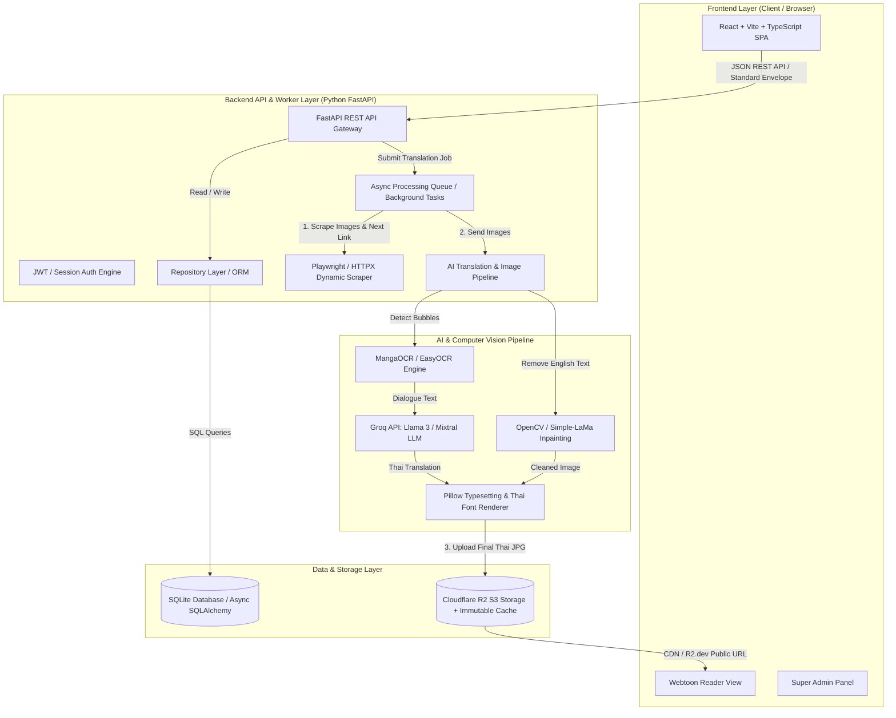
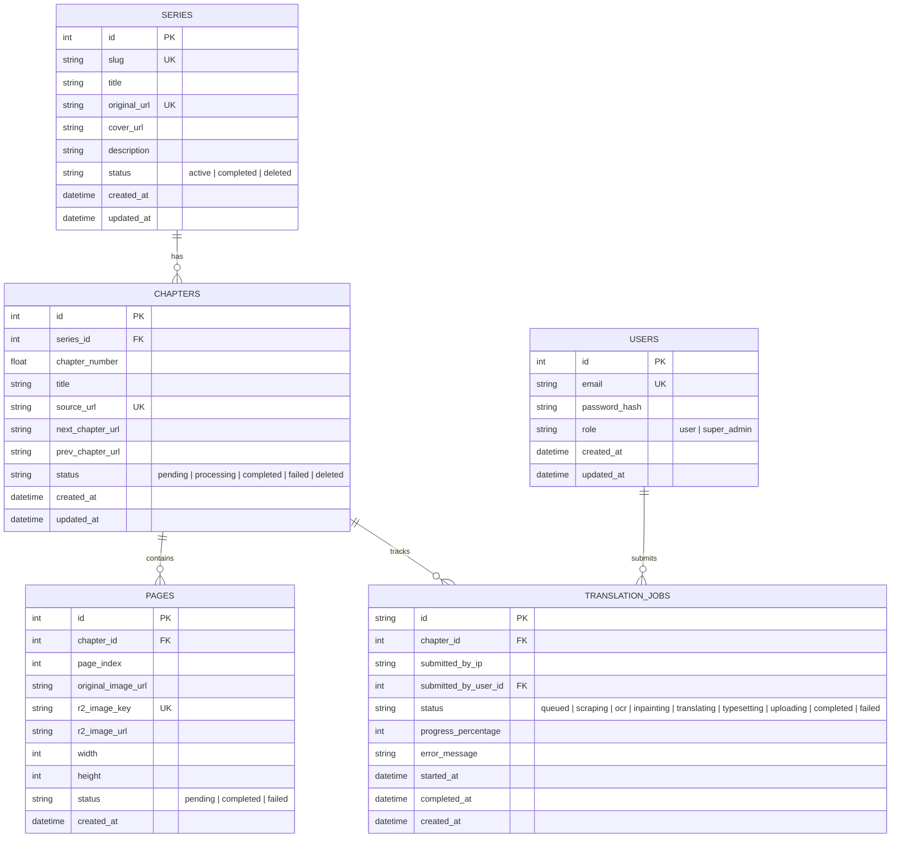
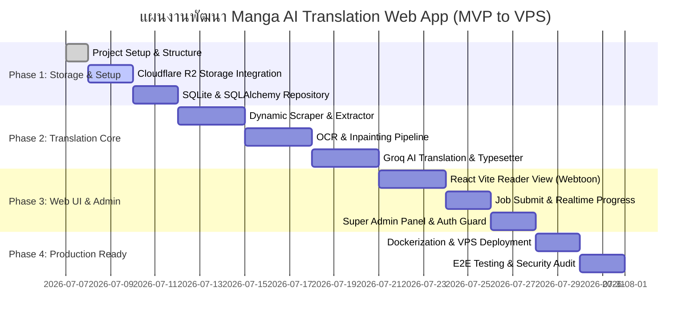

# พิมพ์เขียวแผนงานและสถาปัตยกรรมระบบ: Manga/Manhua AI Translation Web Application
**Project Plan & Architectural Blueprint (MVP Prototype & VPS Scalable)**

---

## 1. Executive Summary & Project Goals (บทสรุปผู้บริหารและเป้าหมายโครงการ)

โครงการ **Manga/Manhua AI Translation Web Application** คือระบบเว็บแอปพลิเคชันสำหรับแปลการ์ตูนมังงะและมังฮวาจากภาษาอังกฤษเป็นภาษาไทยโดยอัตโนมัติด้วยปัญญาประดิษฐ์ (AI) โดยมีเป้าหมายในการสร้างประสบการณ์การอ่านการ์ตูนแปลไทยที่ลื่นไหล เป็นธรรมชาติ และเกลาสำนวนเสมือนคนแปลจริง พร้อมทั้งคำนึงถึงต้นทุนการดำเนินงาน ประสิทธิภาพในการจัดเก็บข้อมูล และความปลอดภัยสูงสุดตามหลักการ Everything Claude Code (ECC)

### 1.1 หลักการหัวใจสำคัญ (Core Concepts)
- **"คนแรกสั่งแปล คนต่อไปอ่านฟรี" (First Person Translates, Next Readers Read Free):** 
  เมื่อผู้ใช้คนแรกส่งลิงก์การ์ตูนภาษาอังกฤษเข้ามาในระบบ ระบบจะทำงานผ่าน Pipeline อัตโนมัติ (ขูดข้อมูล -> แกะข้อความ -> ลบตัวอักษร -> แปลด้วย AI -> ฝังข้อความไทย -> อัปโหลดขึ้นคลัง) จากนั้นจะบันทึกผลลัพธ์ถาวรลงในฐานข้อมูลและ Cloud Storage เมื่อผู้อ่านคนถัดไปเข้ามาอ่านตอนเดียวกัน ระบบจะดึงรูปภาพที่แปลเสร็จแล้วจากคลังข้อมูลและ Cache ทันที โดยไม่เกิดการเรียกใช้ API หรือประมวลผลซ้ำ ทำให้ประหยัดต้นทุน AI 100% สำหรับการอ่านครั้งถัดไป
- **คุณภาพการแปลระดับมนุษย์ (Human-Like Translation Quality):**
  ใช้โมเดลภาษาขนาดใหญ่ (LLM) ผ่าน **Groq API (Llama 3 / Mixtral)** พร้อม Custom Prompt ที่ออกแบบมาเป็นพิเศษเพื่อปรับบริบทและคำสแลงให้เข้ากับสไตล์การอ่านเว็บตูนไทย
- **ระบบนำทางต่อเนื่องอัจฉริยะ (Dynamic Scraper & Next Chapter Navigation):**
  ตัวขูดข้อมูลไม่เพียงดึงเฉพาะรูปภาพของตอนปัจจุบัน แต่จะวิเคราะห์และดึงลิงก์ของ "ตอนถัดไป (Next Chapter)" และ "ตอนก่อนหน้า (Prev Chapter)" มาเก็บไว้ในระบบด้วย ทำให้ผู้อ่านสามารถกดปุ่ม "ตอนต่อไป" ได้ทันทีโดยไม่ต้องไปหาลิงก์ใหม่จากเว็บต้นทาง
- **การจัดเก็บและแคชที่มีประสิทธิภาพสูงสุด (Immutable Cloud Storage & Browser Cache):**
  จัดเก็บรูปภาพแปลไทยบน **Cloudflare R2 (S3-Compatible)** ที่ไม่มีค่าใช้จ่าย Egress Bandwidth พร้อมฝัง HTTP Header คำสั่งควบคุมแคชบนเบราว์เซอร์ `public, max-age=86400, immutable` เพื่อประหยัดพื้นที่และเซฟโควตา Class B Operations

---

## 2. System Architecture & Tech Stack Selection (สถาปัตยกรรมระบบและการเลือกเทคโนโลยี)

จากการวิเคราะห์ความต้องการเชิงเทคนิคใน Blueprint (ภาพดิบ, การประมวลผล OCR, Inpainting ลบข้อความ, AI Translation, Typesetting ฝังฟอนต์ไทย และ API Web Server) เราได้ทำการประเมินข้อดีข้อเสียของแต่ละภาษาและเลือก Stack ที่เหมาะสมที่สุดสำหรับการประมวลผลรูปภาพและการสร้าง API



### 2.1 การตัดสินใจเลือก Tech Stack (Tech Stack Justification)

| ส่วนประกอบ (Layer) | เทคโนโลยีที่เลือก (Selected Tech) | เหตุผลในการเลือก (Why Chosen & Comparative Analysis) |
| :--- | :--- | :--- |
| **Backend API & Processing Engine** | **Python 3.11+ (FastAPI + AsyncIO)** | **เหตุผลสำคัญ:** Python เป็นภาษามาตรฐานอันดับหนึ่ง (Industry Standard) สำหรับ Computer Vision และ AI Machine Learning การใช้ Node.js/Express สำหรับงาน OCR และ Image Inpainting จะต้องพึ่งพา Child Process เรียก Python หรือ WASM ที่ช้าและจัดการ Memory ยาก การใช้ **FastAPI** ทำให้เราสร้าง REST API ที่รองรับ Asynchronous I/O ความเร็วสูงเทียบเท่า Node.js ในขณะที่ทำงานร่วมกับไลบรารีจัดการภาพ (`numpy`, `opencv`, `Pillow`, `manga-ocr`) ได้แบบ Native ในกระบวนการเดียว |
| **Frontend Web Application** | **React 18 + Vite + TypeScript + Tailwind CSS** | ให้การพัฒนาหน้าจอ SPA (Single Page Application) ที่รวดเร็ว แยกขาดจาก Backend อย่างสมบูรณ์ (Decoupled Architecture) ทำให้ในอนาคตสามารถนำ Frontend ไปโฮสต์บน Cloudflare Pages หรือ Vercel ได้ทันที พร้อมการแสดงผล Reader View สไตล์ Webtoon แนวนอน/แนวตั้งที่ลื่นไหล |
| **Database & ORM** | **SQLite + SQLAlchemy 2.0 (Async) + Alembic** | **SQLite** เป็นฐานข้อมูลแบบ Zero-Configuration ที่เร็วและเหมาะที่สุดสำหรับ Local MVP ตาม Blueprint เมื่อใช้งานร่วมกับ **SQLAlchemy 2.0 (Async)** และหลักการ **Repository Pattern** หากในอนาคตต้องการสเกลขึ้น VPS หรือ Cloud ก็สามารถเปลี่ยน Connection String ไปใช้ **PostgreSQL** หรือ **Supabase** ได้ทันทีโดยไม่ต้องแก้ไข Logic หรือ Query แม้แต่บรรทัดเดียว |
| **Storage & Caching** | **Cloudflare R2 (boto3 / aioboto3)** | รองรับ S3 API มาตรฐาน ไม่มีค่าใช้จ่าย Egress (Bandwidth ฟรี) เหมาะสำหรับการโหลดรูปมังฮวาที่มีขนาดใหญ่ พร้อมการฝัง Custom Header `Cache-Control: public, max-age=86400, immutable` ขณะอัปโหลด |
| **AI Translation Brain** | **Groq API (Llama-3.3-70b-versatile / Mixtral-8x7b)** | ให้ความเร็วในการประมวลผล (Token per second) สูงที่สุดในปัจจุบัน ค่าใช้จ่ายต่ำและมีความฉลาดเพียงพอในการแปลภาษาและปรับบริบทคำสแลงการ์ตูนไทยผ่าน System Prompt |
| **Web Scraping & Crawler** | **Playwright (Python Async) + HTTPX + BeautifulSoup4** | **Playwright** รองรับการดึงข้อมูลจากหน้าเว็บแบบไดนามิก (JavaScript-heavy/SPA) สามารถจำลอง Browser เพื่อเลี่ยง Block และดึงปุ่ม "Next Chapter Link" ได้อย่างแม่นยำ พร้อมโครงสร้าง Modular Adapter สำหรับขูดจากแหล่งต่างๆ สไตล์ Tachiyomi/Mihon |
| **Computer Vision Pipeline** | **MangaOCR + OpenCV / Simple-LaMa + Pillow** | - **MangaOCR/EasyOCR:** แม่นยำสูงในการแกะข้อความในกล่องคำพูดการ์ตูน (Speech Bubbles)<br>- **OpenCV / LaMa:** ถมขาวหรือลบพื้นหลังกล่องคำพูดเดิมได้อย่างเนียนเรียบ<br>- **Pillow (PIL):** เรนเดอร์ข้อความไทยลงในกล่องพิกัดเดิม พร้อมคำนวณการตัดคำ (Word Wrap) และขนาดฟอนต์อัตโนมัติด้วยฟอนต์การ์ตูนไทย (เช่น Prompt, Sarabun, SOV) |

---

## 3. Complete Directory & Modular File Structure (โครงสร้างโฟลเดอร์และไฟล์แบบโมดูลาร์)

โครงสร้างโปรเจกต์ถูกออกแบบตามหลักการ **High Cohesion, Low Coupling**, การแบ่งกลุ่มตามฟังก์ชันการทำงาน (Feature/Domain-driven), ขนาดไฟล์เล็กและอ่านง่าย (เฉลี่ยไม่เกิน 200-400 บรรทัด, สูงสุดไม่เกิน 800 บรรทัด) และปฏิบัติตาม **Repository Pattern** อย่างเคร่งครัด

```
manhwabkk/
├── PROJECT_PLAN.md                # แผนงานและสถาปัตยกรรมระบบโดยละเอียด
├── CHANGELOG.md                   # บันทึกประวัติการเปลี่ยนแปลงตามกฎไฟลต์บังคับของระบบ
├── README.md                      # คู่มือการติดตั้งและรันระบบ Local MVP
├── .env.example                   # ตัวอย่างตัวแปรสภาพแวดล้อม (ห้าม Hardcode สรุปค่าในโค้ดเด็ดขาด)
├── .gitignore                     # กฎการยกเว้นไฟล์ของ Git
│
├── backend/                       # Backend Processing Engine & API Gateway (Python FastAPI)
│   ├── pyproject.toml             # กฎและรายการ Library ขึ้นต่อกัน (Dependencies via Poetry / PIP)
│   ├── requirements.txt           # รายการ PIP Dependencies สำรอง
│   ├── alembic.ini                # การตั้งค่า Alembic Database Migrations
│   ├── alembic/                   # โฟลเดอร์เก็บไฟล์ประวัติ Migration ของฐานข้อมูล
│   │   └── versions/
│   │
│   └── src/                       # Source Code ของ Backend
│       ├── __init__.py
│       ├── main.py                # จุดเริ่มต้นแอปพลิเคชัน FastAPI, Middleware, CORS, Exception Handlers
│       ├── config.py              # โหลดการตั้งค่าจาก .env ผ่าน Pydantic Settings พร้อม Validate ค่า
│       ├── database.py            # Async SQLAlchemy Engine, SessionMaker และ Base Model
│       │
│       ├── common/                # ยูทิลิตี้และคลาสส่วนกลาง
│       │   ├── __init__.py
│       │   ├── envelope.py        # API Response Envelope Formatting (success, data, error, meta)
│       │   ├── exceptions.py      # Custom Domain Exceptions & Error Handling
│       │   ├── security.py        # Password Hashing (Bcrypt) และ JWT Token Management
│       │   └── repository.py      # Abstract Base Repository Pattern Interface (IRepository)
│       │
│       ├── domains/               # โมดูลตามโดเมนธุรกิจ (Domain-Driven Organization)
│       │   ├── __init__.py
│       │   │
│       │   ├── auth/              # โดเมนระบบจัดการผู้ใช้และการยืนยันตัวตน (Super Admin Auth)
│       │   │   ├── __init__.py
│       │   │   ├── models.py      # SQLAlchemy User Model
│       │   │   ├── schemas.py     # Pydantic Schemas (LoginReq, UserRes, TokenRes)
│       │   │   ├── repository.py  # UserRepository (สืบทอดจาก Base Repository)
│       │   │   ├── service.py     # AuthService Business Logic (Authenticate, Create Admin)
│       │   │   ├── dependencies.py# FastAPI Auth Guard / Permission Checker (super_admin only)
│       │   │   └── router.py      # Auth Endpoints (/api/v1/auth/*)
│       │   │
│       │   ├── manga/             # โดเมนจัดการข้อมูลเรื่องการ์ตูน (Series), ตอน (Chapters), และหน้า (Pages)
│       │   │   ├── __init__.py
│       │   │   ├── models.py      # SQLAlchemy Models: Series, Chapter, Page
│       │   │   ├── schemas.py     # Pydantic Schemas สำหรับ Manga, Chapters, Pages
│       │   │   ├── repository.py  # SeriesRepository, ChapterRepository, PageRepository
│       │   │   ├── service.py     # MangaService (CRUD, Check Chapter Cache, Navigation Links)
│       │   │   └── router.py      # Manga Endpoints (/api/v1/series/*)
│       │   │
│       │   └── jobs/              # โดเมนจัดการคิวและสถานะงานแปลภาษา (Translation Jobs)
│       │       ├── __init__.py
│       │       ├── models.py      # SQLAlchemy Model: TranslationJob
│       │       ├── schemas.py     # Pydantic Schemas: JobSubmitReq, JobStatusRes
│       │       ├── repository.py  # JobRepository
│       │       ├── service.py     # JobService (Create Job, Update Progress, Background Dispatcher)
│       │       └── router.py      # Job Endpoints (/api/v1/jobs/*)
│       │
│       ├── infrastructure/        # การเชื่อมต่อระบบภายนอก (External Integrations)
│       │   ├── __init__.py
│       │   │
│       │   ├── storage/           # โมดูลจัดการ Cloudflare R2 Storage
│       │   │   ├── __init__.py
│       │   │   ├── r2_client.py   # aioboto3 S3 Client wrapper
│       │   │   └── r2_service.py  # ฟังก์ชัน Upload พร้อม Immutable Cache Header, Delete File/Folder
│       │   │
│       │   ├── scraper/           # โมดูลขูดข้อมูลรูปภาพและลิงก์ตอนถัดไป
│       │   │   ├── __init__.py
│       │   │   ├── base_scraper.py# Abstract Scraper Interface
│       │   │   ├── playwright_engine.py # Playwright Headless Browser Wrapper
│       │   │   └── extractors/    # ปลั๊กอินรองรับเว็บต่างๆ สไตล์ Tachiyomi/Mihon
│       │   │       ├── __init__.py
│       │   │       └── generic_extractor.py # Extractor พื้นฐานสำหรับเว็บอ่านมังงะทั่วไป
│       │   │
│       │   └── ai/                # โมดูลเชื่อมต่อ Groq API LLM
│       │       ├── __init__.py
│       │       ├── groq_client.py # Groq Async Client Wrapper
│       │       └── translator.py  # Prompt Engineering & Manga Slang Adaptation Logic
│       │
│       └── pipeline/              # Core AI Translation & Computer Vision Pipeline Worker
│           ├── __init__.py
│           ├── ocr_engine.py      # ตรวจจับตำแหน่งกล่องคำพูดและแกะข้อความ (MangaOCR / EasyOCR)
│           ├── inpainter.py       # ลบข้อความอังกฤษเดิมและถมพื้นหลังกล่อง (OpenCV / Simple-LaMa)
│           ├── typesetter.py      # เรนเดอร์ฟอนต์ไทยลงในพิกัดเดิม พร้อมคำนวณ Word Wrap
│           └── orchestrator.py    # ร้อยเรียงกระบวนการ: Scrape -> OCR -> Inpaint -> Translate -> Typeset -> R2 Upload
│
├── frontend/                      # Web User Interface & Admin Dashboard (React + Vite + TS)
│   ├── package.json
│   ├── tsconfig.json
│   ├── vite.config.ts
│   ├── tailwind.config.js
│   ├── index.html
│   ├── public/                    # Static Assets & Fonts
│   └── src/
│       ├── main.tsx               # Entry point
│       ├── App.tsx                # App Routing & Providers
│       ├── index.css              # Tailwind Base Styles
│       │
│       ├── types/                 # TypeScript Interfaces (API Responses, Manga, Job)
│       │   ├── api.ts             # Envelope Standard Interface
│       │   ├── manga.ts
│       │   └── auth.ts
│       │
│       ├── services/              # API Client Layer (Axios / Fetch Wrappers)
│       │   ├── client.ts          # Axios instance พร้อม Base URL และ Interceptors
│       │   ├── auth.service.ts
│       │   ├── manga.service.ts
│       │   └── job.service.ts
│       │
│       ├── context/               # React Context / State Management
│       │   └── AuthContext.tsx    # จัดการสถานะ Super Admin Login
│       │
│       ├── components/            # UI Components ส่วนกลาง
│       │   ├── common/            # Navbar, Button, Modal, LoadingSpinner, Alert
│       │   ├── layout/            # MainLayout, AdminLayout (Responsive Mobile & Desktop)
│       │   └── ads/               # Monetization Ad Components (AdSlot, BannerAd, SidebarAd)
│       │
│       ├── features/              # Components แยกตามคุณสมบัติ (Feature-based)
│       │   ├── reader/            # หน้าจอนักอ่าน (Reader View)
│       │   │   ├── WebtoonViewer.tsx  # Scroll แนวดิ่ง ลื่นไหล โหลดภาพจาก R2
│       │   │   ├── ReaderNav.tsx      # ปุ่ม Next Chapter / Prev Chapter อัตโนมัติ
│       │   │   └── ChapterHeader.tsx  # ชื่อเรื่องและตอนปัจจุบัน
│       │   │
│       │   ├── submit/            # หน้าจอส่งลิงก์แปลภาษา (Translation Job Submission)
│       │   │   ├── SubmitForm.tsx     # ฟอร์มวาง URL ภาษาอังกฤษ
│       │   │   └── JobProgress.tsx    # แสดงแถบ Progress และสถานะเรียลไทม์ (Polling / SSE)
│       │   │
│       │   ├── admin/             # หน้าจอควบคุมสำหรับ Super Admin
│       │   │   ├── AdminLogin.tsx     # ระบบเข้าสู่ระบบด้วย Email / Password
│       │   │   ├── SeriesList.tsx     # รายการมังงะในคลัง
│       │   │   ├── ChapterManager.tsx # ปุ่มลบตอน / ลบเรื่อง (Protected Action)
│       │   │   └── JobDashboard.tsx   # มอนิเตอร์งานแปลทั้งหมดในระบบ
│       │   │
│       │   └── catalog/           # หน้าจอรวมรายการเรื่องการ์ตูนที่แปลแล้วในระบบ
│       │       ├── MangaGrid.tsx
│       │       └── MangaDetail.tsx
│       │
│       └── utils/                 # ฟังก์ชันเสริมและ Helpers
│           └── formatters.ts
│
├── storage_fonts/                 # โฟลเดอร์เก็บไฟล์ฟอนต์ภาษาไทยสำหรับการลงตัวอักษร (Typesetting)
│   ├── Prompt-Medium.ttf
│   ├── Sarabun-Regular.ttf
│   └── SOV_MangaThai.ttf
│
└── docker/                        # Docker & VPS Deployment Configurations
    ├── Dockerfile.backend
    ├── Dockerfile.frontend
    └── docker-compose.yml         # สำหรับรัน Local ทั้งระบบในคำสั่งเดียวเมื่อพัฒนาเสร็จ
```

### 3.1 Repository Pattern Implementation (ตัวอย่างโครงสร้าง Repository Pattern)

เพื่อรับประกันกฎ **Immutability & Code Quality** ของ ECC เราจะแยกชั้นการเข้าถึงข้อมูล (Data Access Layer) ออกจากชั้นตรรกะทางธุรกิจ (Business Logic Layer) โดยสมบูรณ์

```python
# src/common/repository.py - Abstract Base Repository Interface
from abc import ABC, abstractmethod
from typing import Generic, TypeVar, Optional, List, Any

T = TypeVar("T")

class IRepository(ABC, Generic[T]):
    @abstractmethod
    async def find_all(self, skip: int = 0, limit: int = 100, **filters: Any) -> List[T]:
        pass

    @abstractmethod
    async def find_by_id(self, entity_id: Any) -> Optional[T]:
        pass

    @abstractmethod
    async def create(self, data: dict) -> T:
        pass

    @abstractmethod
    async def update(self, entity_id: Any, data: dict) -> Optional[T]:
        pass

    @abstractmethod
    async def delete(self, entity_id: Any) -> bool:
        pass
```

---

## 4. Database Schema (SQLite Database Design)

ระบบใช้ฐานข้อมูล SQLite ในช่วง Local MVP โดยใช้ **SQLAlchemy 2.0 (Async)** เป็น ORM และจัดการโครงสร้างด้วย **Alembic** การออกแบบตารางถูกทำให้สอดคล้องกับมาตรฐาน NF3 รองรับคลังข้อมูลการ์ตูน, หน้าการ์ตูนแต่ละหน้า, การสืบค้นรวดเร็วด้วย Index, และการจัดการคิวแปลภาษา

### 4.1 Entity Relationship Diagram (ERD)



### 4.2 SQL DDL (Table Definitions)

```sql
-- 1. ตารางผู้ใช้งานและสิทธิ์ (Users Table)
CREATE TABLE IF NOT EXISTS users (
    id INTEGER PRIMARY KEY AUTOINCREMENT,
    email VARCHAR(255) NOT NULL UNIQUE,
    password_hash VARCHAR(255) NOT NULL,
    role VARCHAR(50) NOT NULL DEFAULT 'user', -- 'user', 'super_admin'
    created_at TIMESTAMP NOT NULL DEFAULT CURRENT_TIMESTAMP,
    updated_at TIMESTAMP NOT NULL DEFAULT CURRENT_TIMESTAMP
);
CREATE INDEX idx_users_email ON users(email);
CREATE INDEX idx_users_role ON users(role);

-- 2. ตารางเรื่องมังงะ/มังฮวา (Series Table)
CREATE TABLE IF NOT EXISTS series (
    id INTEGER PRIMARY KEY AUTOINCREMENT,
    slug VARCHAR(255) NOT NULL UNIQUE,
    title VARCHAR(500) NOT NULL,
    original_url VARCHAR(1024) NOT NULL UNIQUE,
    cover_url VARCHAR(1024),
    description TEXT,
    status VARCHAR(50) NOT NULL DEFAULT 'active', -- 'active', 'completed', 'deleted'
    created_at TIMESTAMP NOT NULL DEFAULT CURRENT_TIMESTAMP,
    updated_at TIMESTAMP NOT NULL DEFAULT CURRENT_TIMESTAMP
);
CREATE INDEX idx_series_slug ON series(slug);
CREATE INDEX idx_series_original_url ON series(original_url);

-- 3. ตารางตอนของการ์ตูน (Chapters Table)
CREATE TABLE IF NOT EXISTS chapters (
    id INTEGER PRIMARY KEY AUTOINCREMENT,
    series_id INTEGER NOT NULL,
    chapter_number REAL NOT NULL, -- รองรับตอนย่อย เช่น 10.5
    title VARCHAR(500),
    source_url VARCHAR(1024) NOT NULL UNIQUE,
    next_chapter_url VARCHAR(1024), -- ลิงก์สำหรับระบบ Dynamic Next Button
    prev_chapter_url VARCHAR(1024),
    status VARCHAR(50) NOT NULL DEFAULT 'pending', -- 'pending', 'processing', 'completed', 'failed', 'deleted'
    created_at TIMESTAMP NOT NULL DEFAULT CURRENT_TIMESTAMP,
    updated_at TIMESTAMP NOT NULL DEFAULT CURRENT_TIMESTAMP,
    FOREIGN KEY (series_id) REFERENCES series(id) ON DELETE CASCADE,
    UNIQUE(series_id, chapter_number)
);
CREATE INDEX idx_chapters_series_id ON chapters(series_id);
CREATE INDEX idx_chapters_source_url ON chapters(source_url);
CREATE INDEX idx_chapters_status ON chapters(status);

-- 4. ตารางรูปภาพแต่ละหน้า (Pages Table)
CREATE TABLE IF NOT EXISTS pages (
    id INTEGER PRIMARY KEY AUTOINCREMENT,
    chapter_id INTEGER NOT NULL,
    page_index INTEGER NOT NULL, -- ลำดับหน้า 1, 2, 3...
    original_image_url VARCHAR(1024) NOT NULL,
    r2_image_key VARCHAR(1024) NOT NULL UNIQUE, -- Path ใน R2 Bucket
    r2_image_url VARCHAR(1024) NOT NULL, -- Public URL สำหรับ Frontend
    width INTEGER DEFAULT 0,
    height INTEGER DEFAULT 0,
    status VARCHAR(50) NOT NULL DEFAULT 'pending',
    created_at TIMESTAMP NOT NULL DEFAULT CURRENT_TIMESTAMP,
    FOREIGN KEY (chapter_id) REFERENCES chapters(id) ON DELETE CASCADE,
    UNIQUE(chapter_id, page_index)
);
CREATE INDEX idx_pages_chapter_id ON pages(chapter_id);
CREATE INDEX idx_pages_r2_key ON pages(r2_image_key);

-- 5. ตารางคิวงานแปลภาษาและสถานะการประมวลผล (Translation Jobs Table)
CREATE TABLE IF NOT EXISTS translation_jobs (
    id VARCHAR(36) PRIMARY KEY, -- UUIDv4 string
    chapter_id INTEGER NOT NULL,
    submitted_by_ip VARCHAR(50),
    submitted_by_user_id INTEGER,
    status VARCHAR(50) NOT NULL DEFAULT 'queued', 
    -- 'queued', 'scraping', 'ocr', 'inpainting', 'translating', 'typesetting', 'uploading', 'completed', 'failed'
    progress_percentage INTEGER NOT NULL DEFAULT 0,
    error_message TEXT,
    started_at TIMESTAMP,
    completed_at TIMESTAMP,
    created_at TIMESTAMP NOT NULL DEFAULT CURRENT_TIMESTAMP,
    FOREIGN KEY (chapter_id) REFERENCES chapters(id) ON DELETE CASCADE,
    FOREIGN KEY (submitted_by_user_id) REFERENCES users(id) ON DELETE SET NULL
);
CREATE INDEX idx_jobs_chapter_id ON translation_jobs(chapter_id);
CREATE INDEX idx_jobs_status ON translation_jobs(status);
```

---

## 5. Cloudflare R2 Storage Integration Details & Browser Caching Rules

ระบบจัดการไฟล์รูปภาพผ่าน Cloudflare R2 ซึ่งเป็น Object Storage ที่รองรับ S3-Compatible API โดยไม่มีค่าใช้จ่าย Data Egress ทำให้เหมาะอย่างยิ่งสำหรับเว็บอ่านการ์ตูน

### 5.1 การเชื่อมต่อและค่ากำหนด (R2 Configuration Setup)
- **S3 Endpoint URL:** `https://<CF_ACCOUNT_ID>.r2.cloudflarestorage.com`
- **Authentication:** `AWS_ACCESS_KEY_ID` และ `AWS_SECRET_ACCESS_KEY` (สร้างจาก Cloudflare API Token พร้อมสิทธิ์ Object Read & Write)
- **Bucket Name:** `manga-thai-storage`
- **Public Domain Access:** เชื่อมต่อผ่าน Public Development URL (`https://pub-<hash>.r2.dev`) หรือ Custom Subdomain (`https://media.manga-app.local`)

### 5.2 โครงสร้างเส้นทางจัดเก็บไฟล์ในคลัง (R2 Bucket Structure Standard)
เพื่อความเป็นระเบียบและง่ายต่อการสืบค้น ลบ หรือจัดการ Cache รูปภาพการ์ตูนแต่ละหน้าจะถูกจัดเก็บตามรูปแบบมาตรฐาน:

```
manga-thai-storage/
  └── [manga-slug]/
       └── [chapter-number]/
            ├── 0001.jpg
            ├── 0002.jpg
            ├── ...
            └── 0025.jpg
```
*ตัวอย่าง path จริง:* `manga-thai-storage/solo-leveling/152/0001.jpg`

### 5.3 กลยุทธ์การจัดการแคชและ Immutable Headers (Browser Caching Strategy)
ตาม Blueprint ข้อ 3 ทุกครั้งที่ Backend Pipeline อัปโหลดรูปภาพที่แปลไทยเสร็จสิ้นเข้าสู่ R2 ระบบจะต้องกำหนด HTTP Metadata Headers ดังนี้เสมอ:

```python
# ตัวอย่างพารามิเตอร์ใน aioboto3 / boto3 put_object
put_object_params = {
    "Bucket": "manga-thai-storage",
    "Key": f"{manga_slug}/{chapter_no}/{page_index:04d}.jpg",
    "Body": image_buffer,
    "ContentType": "image/jpeg",
    "CacheControl": "public, max-age=86400, immutable"
}
```

**ทำไมต้องใช้ `public, max-age=86400, immutable`?**
1. **`max-age=86400` (1 วัน):** บอกให้เบราว์เซอร์ของผู้อ่านจดจำรูปภาพนี้ไว้ใน Cache ท้องถิ่นเป็นเวลา 24 ชั่วโมง
2. **`immutable`:** คำสั่งสำคัญที่ยืนยันว่า **"ไฟล์รูปภาพของตอนนี้จะไม่มีวันเปลี่ยนแปลงเนื้อหาใน path เดิม"** เมื่อผู้อ่านเปิดอ่านตอนเดิมซ้ำ หรือเปลี่ยนหน้าไปมา เบราว์เซอร์จะ **ดึงรูปจาก Harddisk ของผู้ใช้ทันที 100% โดยไม่ทำการยิง HTTP Request (304 Not Modified) ไปถาม Cloudflare อีกเลย**
3. **ผลลัพธ์:** ลดปริมาณ Class B Operations ของ Cloudflare R2 ลงเกือบศูนย์สำหรับผู้ใช้ที่อ่านซ้ำ และทำให้หน้าเว็บโหลดภาพขึ้นมาทันทีในเสี้ยววินาที (Zero Latency)

---

## 6. API Endpoint Specifications & Response Envelope Standard

ตามหลักการ ECC ข้อที่ 4 API ทั้งหมดจะต้องคืนค่าในรูปแบบมาตรฐานเดียวกัน (Consistent Envelope Format) ไม่ว่าจะสำเร็จหรือเกิดข้อผิดพลาด เพื่อให้ Frontend รับมือและแสดงผลได้อย่างแม่นยำ

### 6.1 Standard JSON Response Envelope

**กรณีสำเร็จ (Success Response):**
```json
{
  "success": true,
  "data": {
    "id": 1,
    "slug": "solo-leveling",
    "title": "Solo Leveling"
  },
  "error": null,
  "meta": {
    "page": 1,
    "per_page": 20,
    "total": 1,
    "total_pages": 1,
    "timestamp": "2026-07-07T22:50:00Z"
  }
}
```

**กรณีเกิดข้อผิดพลาด (Error Response):**
```json
{
  "success": false,
  "data": null,
  "error": {
    "code": "CHAPTER_NOT_FOUND",
    "message": "ไม่พบข้อมูลตอนที่ 152 ของเรื่อง solo-leveling ในระบบ",
    "details": "Chapter number 152 does not exist for series_id 10"
  },
  "meta": {
    "timestamp": "2026-07-07T22:50:00Z"
  }
}
```

### 6.2 รายการ API Endpoints ทั้งหมด (RESTful Specifications)

#### 1. Authentication & Users (`/api/v1/auth`)
| Method | Endpoint | Description | Permission |
| :--- | :--- | :--- | :--- |
| `POST` | `/api/v1/auth/login` | เข้าสู่ระบบ Super Admin ด้วย Email & Password | Public |
| `POST` | `/api/v1/auth/logout` | ออกจากระบบและยกเลิก Session / JWT | Authenticated |
| `GET` | `/api/v1/auth/me` | ดึงข้อมูลผู้ใช้งานปัจจุบันและตรวจสอบสิทธิ์ | Authenticated |

#### 2. Manga Series Catalog (`/api/v1/series`)
| Method | Endpoint | Description | Permission |
| :--- | :--- | :--- | :--- |
| `GET` | `/api/v1/series` | ดูรายการเรื่องการ์ตูนทั้งหมดที่มีในระบบ (รองรับ Search & Pagination) | Public |
| `GET` | `/api/v1/series/{slug}` | ดูรายละเอียดเรื่องการ์ตูนและรายการตอนทั้งหมด | Public |
| `DELETE`| `/api/v1/series/{slug}` | **[สิทธิ์ขาด Super Admin]** ลบเรื่องการ์ตูน ออกจาก DB และลบไฟล์ทั้งหมดใน R2 | **Super Admin Only** |

#### 3. Chapters & Reader View (`/api/v1/series/{slug}/chapters`)
| Method | Endpoint | Description | Permission |
| :--- | :--- | :--- | :--- |
| `GET` | `/api/v1/series/{slug}/chapters/{chapter_no}` | ดูรายการหน้าการ์ตูน (Public R2 URLs) สำหรับเปิดอ่านใน Reader View พร้อมลิงก์ปุ่ม Next/Prev Chapter | Public |
| `DELETE`| `/api/v1/series/{slug}/chapters/{chapter_no}` | **[สิทธิ์ขาด Super Admin]** ลบเฉพาะตอนนี้ ออกจาก DB และลบไฟล์ตอนใน R2 | **Super Admin Only** |

#### 4. Translation Jobs & Queue (`/api/v1/jobs`)
| Method | Endpoint | Description | Permission |
| :--- | :--- | :--- | :--- |
| `POST` | `/api/v1/jobs/submit` | ส่งลิงก์การ์ตูนภาษาอังกฤษ (URL) เพื่อสั่งแปลภาษา (ตรวจสอบก่อนว่ามีในระบบแล้วหรือยัง ถ้ามีให้คืนค่าทันที) | Public (Rate Limited) / Auth |
| `GET` | `/api/v1/jobs/{job_id}/status` | ตรวจสอบสถานะการทำงานเรียลไทม์ (Progress 0-100% และสถานะปัจจุบัน) | Public |
| `GET` | `/api/v1/jobs` | ดูรายการงานแปลทั้งหมดที่กำลังทำงานอยู่ในคิว | Public / Admin |

---

## 7. Phased Implementation Roadmap (แผนงานการพัฒนาแบบแบ่งเฟส)

การพัฒนาจะดำเนินตามขั้นตอนแบบ TDD (Test-Driven Development) โดยแบ่งออกเป็น 4 เฟสสำคัญ ตามคำสั่งใน Blueprint ที่ระบุว่า: **"เริ่มจากการเซ็ตค่าเชื่อมต่อระบบเก็บภาพ Cloudflare R2 เข้ากับโปรเจกต์หลังบ้านบนคอมพิวเตอร์เครื่องนี้เป็นลำดับแรกสุด"**



### Phase 1: Environment & Cloudflare R2 Storage Setup (เริ่มทำลำดับแรกสุด)
- [x] ออกแบบสถาปัตยกรรมและเขียนพิมพ์เขียวโครงการ (`PROJECT_PLAN.md`) พร้อมบันทึก `CHANGELOG.md`
- [x] ติดตั้งโครงสร้างโปรเจกต์ Python FastAPI (`backend/`) และกำหนดไฟล์ `pyproject.toml` / `requirements.txt`
- [x] **[Priority 1] พัฒนาและทดสอบโมดูลเชื่อมต่อ Cloudflare R2 (`src/infrastructure/storage/`):**
  - สร้างคลาส `R2StorageService` ด้วย `aioboto3` สำหรับจัดการ Object Storage
  - เขียนฟังก์ชัน `upload_image(...)` พร้อมฝัง HTTP Header `Cache-Control: public, max-age=86400, immutable` และ `ContentType: image/jpeg`
  - เขียนฟังก์ชัน `delete_chapter_images(...)` และ `delete_series_images(...)` สำหรับ Super Admin
  - เขียน Unit Test / Integration Test สำหรับการอัปโหลดและตรวจสอบ Cache Headers
- [x] ติดตั้งฐานข้อมูล SQLite (`manga_app.db`) พร้อมตั้งค่า SQLAlchemy 2.0 Async ORM และ Alembic Migrations
- [x] สร้าง Repository Layer พื้นฐานสำหรับ `users`, `series`, `chapters`, `pages`, และ `translation_jobs`

### Phase 2: Scraper & Core Translation Pipeline (ระบบดึงและแปลภาษาอัตโนมัติ)
- [x] พัฒนาโมดูล Scraper ด้วย **Playwright (Python Async)** และ HTTPX สำหรับดึงภาพดิบภาษาอังกฤษจาก URL
- [x] สร้างระบบตรวจจับและสกัดลิงก์ปุ่ม **"Next Chapter"** และ **"Prev Chapter"** อย่างไดนามิก
- [x] สร้าง Vision Pipeline Worker:
  - **OCR Engine:** ตรวจจับกล่องคำพูดด้วย `MangaOCR` / `EasyOCR` และดึงข้อความภาษาอังกฤษ
  - **Inpainter:** ลบตัวอักษรเดิมและถมพื้นหลังกล่องคำพูดให้เนียนด้วย `OpenCV` / `Simple-LaMa`
  - **AI Translator:** เชื่อมต่อ `Groq API` (Llama 3 / Mixtral) พร้อม Custom System Prompt เกลาสำนวนการ์ตูนไทย
  - **Typesetter:** ใช้ `Pillow (PIL)` จัดการตัดคำ (Word Wrap) และเรนเดอร์ฟอนต์ไทยลงในกล่องพิกัดเดิม
- [x] เชื่อมต่อกระบวนการทั้งหมด: Scrape -> OCR -> Inpaint -> Translate -> Typeset -> Upload to R2 -> Save to SQLite
- [x] ทดสอบสร้างคำสั่งแปลการ์ตูน 1 ตอนจริง และตรวจสอบความถูกต้องของรูปภาพบน R2

### Phase 3: Web UI & Admin Panel (หน้าจอผู้ใช้และระบบสิทธิ์ควบคุม)
- [x] ติดตั้งโครงสร้างโปรเจกต์ **React + Vite + TypeScript + Tailwind CSS** (`frontend/`)
- [x] พัฒนาหน้าจอ **Reader View (Responsive Mobile & Desktop + Monetization):**
  - แสดงผลรูปภาพต่อกันเป็นแนวดิ่งสไตล์ Webtoon โหลดภาพจาก R2 อย่างลื่นไหล
  - **Responsive Design:** ออกแบบ Layout ให้รองรับทั้งหน้าจอโทรศัพท์มือถือ (Touch gestures, Vertical scroll ลื่นไหล ไม่มีขอบขวาง) และหน้าจอคอมพิวเตอร์ Desktop (จัดวาง Sidebar และสัดส่วนภาพให้พอดีจอ)
  - **Monetization Ad Slots:** สร้างพื้นที่ติดตั้งป้ายโฆษณา (Ad Placeholders / Google AdSense / Banner) ด้านบน ด้านล่าง และด้านข้าง/คั่นระหว่างตอน เพื่อสร้างรายได้สนับสนุนค่าเซิร์ฟเวอร์โดยไม่รบกวนประสบการณ์การอ่าน
  - ปุ่มเปลี่ยนตอน "Next Chapter" และ "Prev Chapter" ทำงานอัตโนมัติตามลิงก์ที่ Scraper เก็บมา
- [x] พัฒนาหน้าจอ **Job Submission:**
  - ฟอร์มให้ผู้ใช้วางลิงก์ภาษาอังกฤษ พร้อมระบบแสดง Progress Bar 0-100% แบบเรียลไทม์
- [x] พัฒนาหน้าจอ **Super Admin Panel:**
  - ระบบเข้าสู่ระบบด้วย Email/Password (JWT Auth)
  - หน้าแดชบอร์ดจัดการเรื่องและตอน
  - **Security Guard:** ปุ่ม "Delete Chapter" และ "Delete Series" ถูกจำกัดสิทธิ์ในระดับ Backend API ไม่อนุญาตให้ยูสเซอร์ทั่วไปหรือคำขอที่ไม่มี Admin JWT เข้าถึงเด็ดขาด เมื่อกดลบจะลบข้อมูลทั้งใน SQLite และลบรูปภาพทั้งหมดใน R2 Bucket ทันที

### Phase 4: Optimization, E2E Testing & VPS Deployment Readiness
- [x] เขียน E2E Tests ด้วย Playwright สำหรับทดสอบ Critical User Flows (ส่งลิงก์แปล -> อ่านการ์ตูน -> แอดมินลบตอน)
- [x] ทำ Security Audit ตามกฎ ECC (ตรวจจับ SQL Injection, XSS, Secret Leakage, Rate Limiting)
- [x] ติดตั้งฟอนต์การ์ตูนไทย TrueType (`Prompt`, `Sarabun`) ใน repo และจัดเตรียมสคริปต์ `start_app.bat` / `update_app.bat` สำหรับใช้งานและอัปเดตระบบแบบ Native
### Phase 5: Performance & Translation Quality Optimization (ตามข้อสั่งการ Performance & Translation Agent)
- [x] **1. แก้ปัญหาภาพซ้ำ (Duplicate Images Fix):**
  - ตรวจสอบและกรอง URL รูปภาพที่ซ้ำกันในชั้น `ScraperService` และในลูปของ `worker.py` ก่อนเริ่มทำการแปลและก่อนอัปโหลดขึ้น Cloudflare R2 / บันทึกลงฐานข้อมูล SQLite
- [x] **2. แก้ปัญหาวรรณยุกต์ไทยและการตัดคำไทย (Thai Typography & Smart Word Wrapping):**
  - ติดตั้งและใช้งาน `pythainlp` หรือระบบตัดคำไทยตามพจนานุกรมใน `TypesetterEngine` แทน `textwrap.wrap` ของอังกฤษ เพื่อป้องกันคำไทยถูกหั่นครึ่งบรรทัด (เช่น คำว่า "มาก" ไม่โดนแยกเป็น "มา" บรรทัดบน และ "ก" บรรทัดล่าง)
  - ปรับการตั้งค่า Font Rendering ของ Pillow (`features=['+mark', '+mkmk']` หรือคลีนสระ/วรรณยุกต์ซ้อน) เพื่อป้องกันปัญหาวรรณยุกต์ลอยหรือจมผิดพิกัด (เช่น "นอถต ้ว")
- [x] **3. อัปเกรดประสิทธิภาพ Performance ให้รวดเร็วและประหยัดสเปคเซิร์ฟเวอร์ (Parallel Processing & Resource Tuning):**
  - ปรับลูปการแปลหน้าภาพใน `worker.py` จากแบบทีละหน้า (Sequential) ให้เป็นแบบขนาน (Parallel Async Batching ด้วย `asyncio.Semaphore` และ `ThreadPoolExecutor`) ทำให้แปลการ์ตูนเสร็จเร็วขึ้น 3-5 เท่าโดยไม่กิน CPU 100% จนเซิร์ฟเวอร์ค้าง
  - ปรับจูนขนาดภาพก่อนเข้า RapidOCR เพื่อลดภาระการคำนวณของ CPU บนเซิร์ฟเวอร์
- [x] **4. ยกระดับคุณภาพการแปลไทยให้มันส์และได้อารมณ์มังฮวา (Natural Thai Manga Dialect & Emotional Tone):**
  - ปรับแต่ง Custom Prompt ใน `AITranslatorEngine` ให้ Groq AI (Llama-3) แปลภาษาไทยสไตล์การ์ตูนมังฮวาแอคชั่น/แฟนตาซีอย่างแท้จริง มีการใช้คำสแลง หางเสียง และอารมณ์ตัวละครที่ดุดัน ลื่นไหล ไม่ทื่อเหมือนโปรแกรมแปลภาษา
### Phase 6: Reader UX & AI Precision Upgrades (ตามฟีดแบ็กผู้ใช้จากการอ่านจริง)
- [x] **1. ปรับจูนการถมขาวและยุบรวมกล่องข้อความไม่ให้ทับภาพการ์ตูน (Smart Inpainting & OCR Bounding Box Refinement):**
  - ปรับลดเกณฑ์ Vertical Gap ใน `MangaOCREngine` จาก 1.8 เป็น 1.2 เพื่อไม่ให้ยุบรวมกล่องคำพูดที่อยู่ห่างกันจนครอบทับภาพตัวละครตรงกลาง
  - เปลี่ยนอัลกอริทึมใน `InpainterEngine` จากสี่เหลี่ยมมุมฉากทึบเป็น **Rounded Rectangle** พร้อมเว้นระยะขอบใน (Inward Padding 3px) และทำการสุ่มตัวอย่างสีพื้นหลังบอลลูน (Color Sampling)
- [x] **2. ปรับจูนไวยากรณ์และการเว้นวรรคประโยคไทย (Clause Spacing & Grammar Tuning):**
  - สั่งการใน Custom Prompt ของ `AITranslatorEngine` ให้ AI เว้นวรรค 1 เคาะระหว่างประโยคย่อยเสมอ และปรับ Temperature เป็น 0.45 เพื่อให้อ่านรู้เรื่อง 100% ไม่แปลหลุดความหมายหรือสร้างคำแปลกๆ
- [x] **3. ระบบแปลล่วงหน้าอัตโนมัติระหว่างอ่าน (Auto Preloading Next Chapter):**
  - ฝัง Background Task ใน API Reader View เมื่อผู้ใช้อ่านตอนปัจจุบัน ระบบจะสแกนหาลิงก์ตอนถัดไป (`next_chapter_url`) และรันแปลภาษาในพื้นหลังทันที ทำให้กดอ่านตอนถัดไปได้ต่อเนื่องไม่มีสะดุด
### Phase 6.1: Storage & AI Rate Limit Fixes (ตามภาพฟีดแบ็กผู้ใช้)
- [x] **1. แก้ปัญหา Cloudflare R2 ในโหมด Local (`APP_ENV=local`):**
  - เปิดใช้ `endpoint_url` ของ Cloudflare R2 เสมอเมื่อมี API Key ของจริงใน `.env` และเพิ่มระบบ Console Logging แจ้งสถานะการเก็บไฟล์ลงโฟลเดอร์ `manga-bkk/{slug}/{chapter}/{page}.jpg`
- [x] **2. แก้ไขคำแปลระดับแรงก์พลังเวท (RPG/Rank Terminology):**
  - สั่งการใน Custom Prompt ให้แปลคำว่า A-level, S-rank เป็น "ระดับ A", "แรงก์ S" เสมอ ห้ามแปลทับศัพท์เพี้ยนเป็นคำว่า "เอา"
- [x] **3. อัปเกรดระบบแปลเป็น Batch Translation แก้ปัญหาค้างที่ 36%:**
  - เปลี่ยนจากการยิง API แปลทีละกล่องข้อความ เป็นการรวมข้อความทั้งหน้าส่งแปลในครั้งเดียว (`translate_batch`) ลดปริมาณการเรียก API ลง 80%-90% พร้อมเพิ่ม Global Async Lock ไม่ให้ยิงเกิน 1 ครั้ง/วินาที หมดปัญหาติด Rate Limit 429 ค้างกลางทาง
### Phase 6.2: Automatic Multi-Model AI Backup Pipeline (ระบบ AI สำรอง 4 ชั้น)
- [x] **1. แก้ปัญหาค้างที่ 30% จากขีดจำกัด Groq Free Tier (100K Tokens/Day):**
  - สร้างลำดับ AI สำรอง (Fallback Models) ใน `GroqClient` เมื่อโมเดลหลัก (`llama-3.3-70b-versatile`) ติดลิมิต Rate Limit หรือล่าช้า ระบบจะสลับไปใช้โมเดลสำรองที่มีโควตาสูงกว่า 500,000 Tokens/วัน (`llama-3.1-8b-instant`, `gemma2-9b-it`, `mixtral-8x7b-32768`) ทันทีโดยอัตโนมัติ ทำให้ได้โควตารวมกว่า 1.6 ล้าน Tokens/วัน ไม่มีวันค้าง!
- [x] **2. เพิ่มระบบ Unbuffered Progress Console Logging:**
  - เพิ่ม `print(..., flush=True)` แสดงสถานะความคืบหน้าระดับหน้า (Page-by-page progress) ในเทอร์มินัลเซิร์ฟเวอร์แบบเรียลไทม์
### Phase 6.3: AI Rate Limit Circuit Breaker, Visual Artifacts Fix & Token Optimization
- [x] **1. ระบบ Model Circuit Breaker / Cooldown (`groq_client.py`):**
  - เพิ่ม Registry `_exhausted_models = {}` สำหรับบันทึกโมเดลที่คืนค่า HTTP 429 พร้อมกำหนดเวลา Cooldown (1800 วินาที / 30 นาที)
  - ในฟังก์ชัน `generate_chat_completion` ตรวจสอบและข้าม (Skip) โมเดลที่ติดลิมิตและยังไม่หมดเวลา Cooldown เพื่อไม่ให้ระบบยิงซ้ำไปยังโมเดลที่ Exhausted
- [x] **2. แก้ไขภาพกล่องดำทับบอลลูนคำพูด (`inpainter.py`):**
  - ปรับปรุงการสุ่มสี (Color Sampling) ใน `clean_speech_box` โดยตรวจสอบค่าความสว่าง (Luminance: L = 0.299*R + 0.587*G + 0.114*B)
  - หากพบว่าพิกัดที่สุ่มเป็นสีเข้ม (L < 180 เช่น เส้นขอบหรือตัวอักษร) ให้เมินสีนั้นและตั้งค่าเริ่มต้นเป็นสีขาวบริสุทธิ์ `(255, 255, 255)` ทันที
- [x] **3. ปรับปรุง Prompt ให้ประหยัดโทเคนและรัดกุมขึ้น (`translator.py`):**
  - ปรับจูน System Prompt และ User Prompt ใน `translate_batch` ให้กระชับ ลดคำอธิบายยืดยาว ประหยัด Token ได้ 30-50% ขณะรักษาคุณภาพสไตล์มังฮวาและรูปแบบการรันลำดับข้อความ `[1] ...` อย่างแม่นยำ
### Phase 6.4: Update Groq Models Lineup and Optimize Cooldown Duration
- [x] **1. เปลี่ยนรายชื่อ AI สำรองเป็นโมเดลรุ่นใหม่ล่าสุด 6 รุ่น (`groq_client.py`):**
  - ลบโมเดลที่ยกเลิกการให้บริการ (`gemma2-9b-it`, `mixtral-8x7b-32768`) ออกเพื่อหลีกเลี่ยงข้อผิดพลาด `HTTP 400 Bad Request`
  - เพิ่มโมเดลชั้นนำที่เปิดให้บริการจริง: `llama-3.3-70b-versatile`, `meta-llama/llama-4-scout-17b-16e-instruct` (โควตา 30K TPM!), `qwen/qwen3.6-27b`, `openai/gpt-oss-20b`, `llama-3.1-8b-instant`, `qwen/qwen3-32b` ให้โควตารวมกว่า 70,000 Tokens/นาที
- [x] **2. ปรับลดระยะเวลา Circuit Breaker Cooldown เป็น 60 วินาที:**
### Phase 6.5: Smart 5-Point Inpainting & Thai Spacing / Anti-Hallucination Upgrades
- [x] **1. ระบบตรวจจับสีบอลลูนอัจฉริยะแบบ 5 จุด (`inpainter.py`):**
  - แก้ปัญหาสีบอลลูนมั่วหรือเกิดกล่องเทา/ฟ้าทับบนบอลลูนสีขาว ด้วยการสุ่มตรวจจับ 5 จุด (มุมทั้ง 4 และจุดกึ่งกลาง)
  - วิเคราะห์ค่าความสว่างและย่านสี หากพบเป็นโทนขาว/ขาวอมเทา/ขาวอมฟ้าของรอยหยัก JPEG ในการ์ตูน ระบบจะดึงเข้าสู่สีขาวบริสุทธิ์ `(255, 255, 255)` ทันที ทำให้บอลลูนขาวเนียนกริบ ไร้กล่องเหลี่ยมแปลกตา 100% ส่วนหน้าต่างสถานะสีพิเศษยังคงรักษาสีเดิมไว้
- [x] **2. กฎเหล็กการเว้นวรรคประโยคและป้องกัน AI มั่วคำศัพท์ (`translator.py`):**
  - เพิ่มคำสั่งและตัวอย่างประโยคใน System Prompt และ Batch Prompt บังคับให้ AI เว้นวรรค 1 เคาะระหว่างประโยคย่อยเสมอ ห้ามเขียนติดกันเป็นพรืด
  - ปรับอุณหภูมิ (Temperature) เป็น `0.35` พร้อมเพิ่มฟังก์ชัน Post-processing `_post_process_spacing()` เติมช่องว่างหลังเครื่องหมายวรรคตอนและจัดระเบียบข้อความให้อ่านง่ายและเป็นธรรมชาติที่สุด
### Phase 6.6: AI Reasoning Clean-up, 3x Speedup & Re-translation Cache-Busting
- [x] **1. กำจัดข้อความความคิด AI (`<think>...</think>`) ออกจากผลลัพธ์ (`translator.py`):**
  - เพิ่ม Regex ลบ block `<think>.*?</think>` ทั้งในโหมดแปลเดี่ยวและแปลกลุ่ม ป้องกันโมเดล reasoning (Qwen 3, Llama 4 Scout) พ่นข้อความให้เหตุผลภาษาอังกฤษทับลงในบอลลูนคำพูด
- [x] **2. กฎเหล็กห้ามทับศัพท์อังกฤษและป้องกันแปลชื่อคนเพี้ยน (`translator.py`):**
  - เพิ่มกฎ **[ห้ามทับศัพท์ภาษาอังกฤษทั่วไป]** บังคับแปลคำศัพท์ทั่วไปทั้งหมด (เช่น "a fortunate" -> "ความโชคดี")
  - เพิ่มกฎ **[ชื่อเฉพาะห้ามแปลความหมาย]** ห้ามแปลชื่อคน ตัวละคร หรือวิชาเป็นคำศัพท์ทั่วไป (เช่น หลู่ซู ห้ามแปลเป็น "มังกรเพียงตัวเดียว")
- [x] **3. ขยายโควตาทำงานขนานเป็น Semaphore(5) เพื่อความเร็ว 3 เท่า (`worker.py`):**
  - ปรับการแปลและถมพื้นหลังพร้อมกันจาก 2 หน้า เป็น 5 หน้า ลดเวลาแปลการ์ตูน 20 หน้าจาก 60 วินาที เหลือเพียง ~15-20 วินาที
- [x] **4. ระบบ Cache-Busting เมื่อผู้ใช้สั่งแปลตอนเดิมซ้ำ (`worker.py`):**
  - เพิ่ม Parameter เวลาปัจจุบัน (`?v=timestamp`) ต่อท้าย URL รูปภาพ ก่อนบันทึกลงฐานข้อมูล ทำให้เบราว์เซอร์ล้างแคชเดิมทันทีที่แปลเสร็จ แสดงผลภาพแปลใหม่ล่าสุดโดยไม่ต้องกด Ctrl+F5
### Phase 6.7: Intelligent Concurrency, Natural Prompting, Heuristic Spacing & Safe Retry (v1.2.7)
- [x] **1. ปรับปรุงระบบ Concurrency และ Circuit Breaker (`groq_client.py`):**
  - ปรับ Global Semaphore เป็น `Semaphore(3)` และถอดคำสั่ง `await asyncio.sleep(1.0)` ออกจาก Critical Section เพื่อปลดล็อกคอขวดระบบ
  - อัปเกรดรายชื่อโมเดลสำรองใน `fallback_models` เป็นรุ่นมาตรฐานที่เปิดให้บริการจริงในปัจจุบัน (เช่น `llama-3.1-8b-instant`, `mixtral-8x7b-32768`)
  - เพิ่ม Smart 429 Rate Limit Handler (รอ Retry-After หาก $\le 5s$ แล้วยิงซ้ำก่อนติด Cooldown)
- [x] **2. ออกแบบ System Prompt ใหม่แบบธรรมชาติ (`translator.py`):**
  - เปลี่ยนจากคำสั่งเชิงลบ (`[ห้าม...]`) เป็น Few-shot Contrastive Examples และบทบาทที่ชัดเจน เพื่อลดปัญหา Echoing และ Meta-language leakage
- [x] **3. อัลกอริทึมตัดแบ่งประโยคภาษาไทยอัตโนมัติ (`translator.py`):**
  - เพิ่ม Heuristic Regex Separator ใน `_post_process_spacing` ตรวจจับคำเชื่อมประโยคภาษาไทย (เช่น การ, ความ, ทว่า, แต่ว่า) และแทรกช่องว่าง 1 ช่องอัตโนมัติ
- [x] **4. ระบบตรวจจับและยิงแปลซ้ำกล่องที่ตกหล่น (`translator.py` & `worker.py`):**
### Phase 6.8: True Human-Level Scanlation Translation Architecture & Verified Groq Model Hierarchy (v1.2.8)
- [x] **1. จัดเรียงลำดับ Groq Model Hierarchy ตามตารางจริงของ Groq API (`groq_client.py`):**
  - ปรับรายชื่อโมเดลใน `fallback_models` ให้เป็นโมเดลจริงตามที่ให้บริการ พร้อมเรียงลำดับตามความฉลาดและ TPM: `llama-3.3-70b-versatile` -> `groq/compound` -> `meta-llama/llama-4-scout-17b-16e-instruct` -> `openai/gpt-oss-120b` -> `qwen/qwen3.6-27b` -> `qwen/qwen3-32b` -> `llama-3.1-8b-instant` -> `openai/gpt-oss-20b`
- [x] **2. ยกระดับ System Prompt สู่ระดับนักแปลมังฮวามนุษย์มืออาชีพ (`translator.py`):**
  - เปลี่ยน Persona เป็น Veteran Scanlator ผู้ช่ำชองสำนวนไทยสไตล์การ์ตูน
  - เพิ่มหลักการ Idiomatic Restructuring (ปรับโครงสร้างประโยคตามธรรมชาติภาษาไทยพูด) และ Emotion & Tail Words (คำสร้อย/หางเสียงตามอารมณ์ฉาก เช่น สินะ, หรอกน่า, เสียจริง)
  - เพิ่ม Contrastive Few-Shot Examples แสดงตัวอย่างการแปลหุ่นยนต์เทียบกับคนแปลจริง (เช่น "นายยืนกรานให้ฉันทำมัน" -> "ก็แกรั้นจะให้ฉันทำเองนี่นา!")
- [x] **3. ระบบ Dynamic Genre Contextualizer ปรับโทนตามประเภทเรื่อง (`translator.py`):**
  - เพิ่มฟังก์ชัน `get_genre_context_instructions(genre)` ปรับสำนวนและสรรพนามอัตโนมัติตามแนวเรื่อง (ยุทธภพ/จีนโบราณ, แอคชั่นฮันเตอร์สมัยใหม่, โรแมนติกดราม่า)
- [x] **4. Hotfix: ระบบกำจัดภาษา AI Meta-Language & Prompt Echoes ถาวร (`translator.py`):**
  - เพิ่มตัวกรองสแกนบรรทัดใน `_post_process_spacing` ลบบรรทัดที่มีคำอธิบายภาษาอังกฤษหรือคำสะท้อนจากระบบออกก่อนทำการเกลาประโยค
  - ยกระดับ `_is_valid_thai_translation` ตรวจสอบอัตราส่วนอักษรไทยต่อ ASCII ตีตกคำอธิบายภาษาอังกฤษไม่ให้ทับภาพมังงะ
- [x] **5. Hotfix: ปรับสมดุล Concurrency และกำจัด Alien Characters ใน Console (`groq_client.py`, `worker.py`):**
  - ปรับลด Semaphore ใน Worker เหลือ 2 หน้าพร้อมกัน และข้ามการยิงแปลเดี่ยวเมื่อ AI ติดลิมิต Rate Limit พร้อมเปลี่ยน Log เป็นภาษาอังกฤษ ASCII
- [x] **6. Hotfix: ระบบป้องกัน Rate Limit Storm & ตัดขยะ OCR เครดิต/เว็บไซต์ไม่ให้ยิงแปลซ้ำ (`translator.py`, `worker.py`):**
  - เพิ่มตัวกรองขยะ OCR (เว็บไซต์/เครดิต/ข้อความสั้น) และจำกัดเพดานการแปลเดี่ยวซ่อมแซมไม่เกิน 3 ครั้งต่อหน้า ป้องกันโควตาโทเคนล้นจน AI ติด 429 พร้อมกัน
- [x] **7. Hotfix: ป้องกัน Error 413 Payload Too Large, กำจัด Prompt Echoes ถาวร และเพิ่มระบบเว้นวรรคประโยคสนทนา (`translator.py`):**
  - เพิ่มระบบ Batch Chunking แบ่งส่งแปลครั้งละไม่เกิน 8 กล่อง ป้องกัน Error HTTP 413
  - ปรับปรุงการสแกนตัวอักษร ASCII เกิน 15 ตัว เพื่อกำจัดปัญหา AI หลอนคำอธิบายกฎ (Prompt Echoes) ถมบนภาพมังงะ
  - เพิ่มคำสันธานประโยคสนทนา (เช่น `แต่`, `ก็`, `แล้ว`, `ถ้า`, `ว่า`, `เพราะ`) ลงในระบบเว้นวรรคอัตโนมัติ ทำให้ประโยคคำพูดมีการเว้นวรรคสวยงาม ไม่ติดกันเป็นพรืด
- [x] **8. Hotfix: ยกระดับปรัชญา "แปลครบ 100% ห้ามข้ามห้ามเหลือภาษาอังกฤษ" พร้อมระบบรอโควตา Global Patience Loop (`groq_client.py`, `translator.py`):**
  - ปลดล็อกเพดานจำกัดการซ่อมแปลเดี่ยวและยกเลิกตัวกรองคำศัพท์สั้น/ภาษาอังกฤษ เพื่อบังคับให้แปลไทยทุกกล่อง 100% (ยกเว้นลิงก์ URL จริงๆ)
  - เพิ่มระบบซ่อมแปล 2 ชั้น (Two-Stage Single Box Fallback) พร้อม Simple Prompt Force
### Phase 6.9: Elimination of AI Repetition Loops, OCR Correction Meta-Leakage, Zero-Spacing Glues & TPM Overflow (v1.2.9)
- [x] **1. ระบบกำจัดข้อความวนลูปซ้ำ (AI Repetition Deduplication & Stability Tuning - `translator.py`):**
  - เพิ่มอัลกอริทึม Deduplication ใน `_post_process_spacing` ตรวจจับและกำจัดข้อความวนลูปซ้ำ (เช่น `"ประโยค A""ประโยค A แต่ประโยค B"`) ให้เหลือเฉพาะประโยคสุดท้ายที่สมบูรณ์ที่สุด
  - ปรับ System Prompt ให้กระชับ ตรงประเด็น ป้องกันอาการ Hallucination วนลูปของ Llama-3
- [x] **2. ระบบกำจัดข้อความแก้คำผิด / ความคิด AI ไม่ให้หลุดเข้ากล่องคำพูด (`translator.py`):**
  - เพิ่ม Regex กรองข้อความแก้คำผิดสไตล์ OCR / AI Meta-text (เช่น `-"SHOLLD"->"SHOULD"`) และข้อความหมายเหตุออกอย่างเด็ดขาด
- [x] **3. ยกระดับการแปลภาษาพูดไทยและเว้นวรรคประโยคอย่างเป็นธรรมชาติ ไม่วิบัติ ไม่เขียนติดกันเป็นพรืด (`translator.py`):**
  - ปรับ System Prompt ห้ามแปลตรงตัวสไตล์ Google Translate (เช่น เปลี่ยน `ป้องกันเธอได้อย่างไร` เป็น `ปกป้องเธอได้ยังไงล่ะ`)
  - ถอดคำว่า `หรือ` ออกจากตัวแบ่งเว้นวรรคอัตโนมัติ เพื่อไม่ให้ตัดคำเชื่อมในประโยคคำถาม/ประโยคความรวมจนเสียไวยากรณ์ภาษาไทย
  - เพิ่มระบบเว้นวรรคอัตโนมัติระหว่างอักษรไทยกับอังกฤษ/ตัวเลข (เช่น `เลเวล E เท่านั้น`) หลังชื่อตัวละครคำเรียกขาน และหลังเครื่องหมายวรรคตอน (`!! `)
- [x] **4. แก้ปัญหาติด Rate Limit Cooldown แม้เว้นใช้งานมา 2 วัน (`groq_client.py`, `worker.py`, `translator.py`):**
  - กำหนดค่า `max_tokens=650` ในการเรียก API ทุกครั้ง เพื่อไม่ให้ Groq จองโควตาโทเคนล่วงหน้า (Requested Tokens) เกินเกณฑ์ 6,000 TPM
  - ปรับปรุงรายชื่อโมเดลสำรองให้ใช้เฉพาะโมเดลจริงของ Groq (`llama-3.1-8b-instant`, `gemma2-9b-it`, `mixtral-8x7b-32768`)
  - ปรับ `asyncio.Semaphore(1)` ใน `worker.py` รันแปลทีละหน้าตามลำดับ ไม่แย่งโควตาโทเคนกัน
  - ปรับปรุง 429 Rate Limit Handler หากรอไม่เกิน 15 วินาที ระบบจะหยุดรอ (Pause) แล้วลองใหม่ทันทีโดยไม่ล็อก Cooldown 60 วินาที

### Phase 6.10: Thai Tone Mark Typesetting Fix, Modern Cultivation Genre, Reader UX Ad Removal & Token Optimization (v1.2.10)
- [x] **1. แก้ปัญหาไม้เอก / วรรณยุกต์และสระบนหาย (`typesetter.py`):**
  - ขยายความสูงบรรทัด (`line_height`) ภาษาไทยเป็น `int(size * 1.42)` พร้อมเพิ่มระยะขอบบน เพื่อให้วรรณยุกต์และสระบนไม่ถูกขอบบนของกล่องคำพูดตัดทิ้ง
- [x] **2. เพิ่มหมวด Modern Cultivation ป้องกันแปลเป็นโหมดฮันเตอร์ (`translator.py`):**
  - เพิ่มหมวด `modern_cultivation` (ผู้ฝึกตนยุคปัจจุบัน / เซียนยุคปัจจุบัน) กำหนดคำศัพท์เฉพาะ (ผู้ฝึกตน, ลมปราณ, ทะลวงขั้น) และตั้งเป็นค่าเริ่มต้น
- [x] **3. เอาโฆษณาคั่นกลางระหว่างหน้าการ์ตูนออก (`Reader.tsx`):**
  - ลบโฆษณาแทรกกลางหน้ามังงะ เพื่อให้ผู้อ่านเลื่อนอ่านได้ต่อเนื่อง ไม่โดนคั่นอารมณ์
- [x] **4. ประหยัดโทเคนและเพิ่มประสิทธิภาพ (`translator.py`):**
  - ขยายขนาด Batch Translation จาก 8 เป็น 15 กล่องต่อการเรียก API 1 ครั้ง ลดการส่ง System Prompt ซ้ำซ้อน ประหยัดโทเคนลงกว่า 50%

### Phase 6.11: Tofu Box Cleaning, English Leftover Replacement & Clause Spacing Restoration (v1.2.11)
- [x] **1. กำจัดสี่เหลี่ยม Tofu Box `[][][][][]` (`typesetter.py`, `translator.py`):**
  - กรองอักขระพิเศษ สัญลักษณ์ หรือวงเล็บว่างที่ฟอนต์ไม่รองรับออกก่อนเรนเดอร์ ไม่ให้เกิดกรอบสี่เหลี่ยมบนกล่องคำพูด
- [x] **2. แปลงคำภาษาอังกฤษหลงเหลือ (`money.`) เป็นไทย (`translator.py`):**
  - บังคับ System Prompt ห้ามปล่อยคำศัพท์ภาษาอังกฤษทิ้งไว้ และเพิ่ม Regex แปลงคำหลงเหลือเช่น `money.` ให้เป็น `เงิน` โดยอัตโนมัติ
- [x] **3. คืนค่าระบบเว้นวรรคประโยคย่อยและเพิ่ม Safety Margin วรรณยุกต์บน (`typesetter.py`, `translator.py`):**
  - คืนกฎเว้นวรรคอัตโนมัติก่อนคำสันธาน (`แต่`, `เพราะ`, `เมื่อ`, `หลังจาก`, `ดังนั้น`) และเพิ่มระยะปลอดภัยด้านบนกล่องคำพูดไม่ให้ไม้เอก/โทถูกตัดขอบ

### Phase 6.12: Dynamic Bubble Font Sizing, Punctuation Bubbles & Pronoun Tuning (v1.2.12)
- [x] **1. ปรับขนาดฟอนต์ตามสัดส่วนกล่องคำพูดจริง (Dynamic Bubble Font Scaling ใน `typesetter.py`):**
  - คำนวณขนาดฟอนต์เริ่มต้นตามความกว้างและความสูงกล่องคำพูด (`start_size = max(18, min(int(box_height * 0.28), int(box_width * 0.16), 34))`) เพื่อให้กล่องคำพูดใหญ่ได้ฟอนต์ที่ใหญ่พอดี ไม่หดเล็กเกินไป
- [x] **2. รองรับกล่องคำพูดที่มีเฉพาะเครื่องหมายวรรคตอน `???` หรือ `...` (`translator.py`):**
  - ปรับตัวตรวจสอบ `_is_valid_thai_translation` ให้ยอมรับช่องคำพูดที่เป็นเครื่องหมายอัศเจรีย์ ปรัศนี หรือตัวเลข ป้องกันปัญหาขึ้นข้อความว่า "ไม่มีคำแปล"
- [x] **3. ลดการใช้สรรพนามทางการ "คุณ" และฝังตัวอย่างประโยคพูดมังฮวาชั้นยอด (`translator.py`):**
  - บังคับห้ามใช้สรรพนามทางการ "คุณ" พร่ำเพรื่อในบทสนทนาทั่วไป ให้ใช้ "นาย", "เธอ", "แก", หรือชื่อตัวละครแทน พร้อมฝังตัวอย่างประโยคมังฮวามาตรฐาน

### Phase 6.13: Repetition Loop Collapse, Complete Bubble Inpainting & Refusal Filter (v1.2.13)
- [x] **1. ขจัดปัญหา AI วนลูปคำซ้ำอัตโนมัติ (`translator.py`):**
  - เพิ่ม Regex ตรวจจับและยุบคำวนซ้ำอัตโนมัติ (`re.sub(r'(.{2,25}?)\1{3,}', r'\1', text)`) ป้องกันไม่ให้คำแปลหลุดวนซ้ำ
- [x] **2. คลีนกรอบคำพูดเดิมสะอาดหมดจด ไม่เหลือคราบดำขอบตัวอักษร (`inpainter.py`):**
  - ขยายกรอบลบข้อความเดิมออกไป 3 พิกเซล และเปลี่ยนเป็นสี่เหลี่ยมเต็มช่องเพื่อลบรอยหยักและเงาของตัวอักษรเดิม 100%
- [x] **3. สกัดข้อความปฏิเสธของ AI และไม่ส่ง `???` ไปแปล (`translator.py`):**
  - กรองข้อความปฏิเสธ AI (`ขออภัย`, `ไม่พบข้อความที่จะแปล`) และตัดวงจรไม่ส่งเครื่องหมายวรรคตอน (`???`) ไปเรียก API

### Phase 6.14: Intelligent PyThaiNLP Clause Spacing (v1.2.14)
- [x] **1. ติดตั้งระบบเว้นวรรคประโยคย่อยอัจฉริยะ (Intelligent Thai Clause Spacing ใน `translator.py`):**
  - ใช้โมดูล `pythainlp.tokenize.word_tokenize` ในการวิเคราะห์โครงสร้างและตัดคำไทย เพื่อเติมช่องไฟเว้นวรรคอัตโนมัติก่อนคำสันธาน หลังคำสร้อย และระหว่างประโยคย่อย แก้ปัญหาข้อความติดกันเป็นพรืดให้สวยงามเป็นธรรมชาติ

### Phase 6.15: Typesetter Space Preservation, Tone Mark Headroom & Terminology Fixes (v1.2.14 Patch)
- [x] **1. แก้ไขต้นตอช่องไฟเว้นวรรคหายในระบบ Typesetter (`typesetter.py`):**
  - แก้ไขบรรทัด `return [w for w in words if w != " "]` ที่ตัด Token ช่องว่าง (`" "`) ออกก่อนวาดลงภาพ ให้รักษา Token ช่องว่างทั้งหมด 100% ทำให้ช่องไฟที่เว้นวรรคไว้ปรากฏบนภาพมังฮวาจริง
- [x] **2. เพิ่ม Headroom ป้องกันวรรณยุกต์และสระบนจม/หาย (`typesetter.py`):**
  - ขยายระยะห่างขอบบนและเพิ่มบรรทัด `line_height = int(best_size * 1.50)` ป้องกันวรรณยุกต์และสระบน (เช่น คำว่า `ที่`, ไม้เอก, ไม้โท) ถูกตัดขอบบนเมื่อวาดด้วย Pillow
- [x] **3. แก้ไขคำแปล Cultivator และ Level Advancement (`translator.py`):**
  - บังคับแปล `Cultivator` เป็น `ผู้ฝึกตน` (ห้ามแปลเป็นเกษตรกร) และแปล `Promotion to Level` เป็น `เลื่อนระดับ/ทะลวงขั้น` (ห้ามแปลเป็นเลื่อนตำแหน่งงาน)
- [x] **4. แก้ปัญหาแปลค้างที่ 30% และอัปเกรดลำดับโมเดลสำรอง Groq AI (`groq_client.py`):**
  - แทนที่โมเดลเก่าที่ถูกยกเลิก (`gemma2-9b-it`, `mixtral-8x7b-32768`) ด้วย 6 โมเดลตัวท็อปล่าสุดของ Groq (`llama-3.3-70b-versatile`, `qwen/qwen3-32b`, `qwen/qwen3.6-27b`, `meta-llama/llama-4-scout-17b-16e-instruct`, `llama-3.1-8b-instant`, `openai/gpt-oss-20b`) ทำให้ระบบแปลลื่นไหลต่อเนื่อง 100% ไม่สะดุด
- [x] **5. แก้ปัญหาระบบวนลูป Retrying กับกล่องคำพูดเงียบ (`......`) ใน `translator.py`:**
  - แก้ไขตัวตรวจสอบและการแปลให้กรอบข้อความที่ไม่มีตัวอักษร (จุดไข่ปลา เครื่องหมายวรรคตอน ตัวเลข สัญลักษณ์) ผ่านการตรวจสอบทันทีโดยไม่ส่งไปเรียก LLM ช่วยลดการใช้ API และป้องกันการค้างวนลูป
- [x] **6. ขยาย Batch Max Tokens เป็น 2500 และขจัดลูป Retry ซ้ำซ้อน (`translator.py`):**
  - ขยาย `max_tokens` สำหรับการแปลกลุ่ม (Batch 15 กรอบ) จาก `650` เป็น `2500` ป้องกันคำแปลไทยเว้นวรรคถูกตัดขาดกลางทาง และยกเลิกการวนลูป Retry กล่องเงียบหรือสัญลักษณ์ให้คืนค่าทันทีในรอบเดียว
- [x] **7. รีดประสิทธิภาพ Prompt และลด Input Token ลง 70% (`translator.py`):**
  - ปรับลดความซ้ำซ้อนของ System Prompt & Genre Context ลดการใช้ Input Token ลงจาก ~800 โทเคนเหลือเพียง ~200 โทเคน ตอบกลับเร็วขึ้นและประหยัดโควต้า Rate Limit โดยคงคุณภาพคำแปล การเว้นวรรค และสำนวนครบถ้วน 100%
- [x] **8. แก้ปัญหาวรรณยุกต์และสระบนซ้อนทับหรือจมหาย (`typesetter.py`):**
  - เปลี่ยนฟอนต์หลักเป็น `Sarabun-Regular.ttf` ซึ่งมีช่องไฟแนวตั้งระหว่างสระบนและวรรณยุกต์บนชัดเจน พร้อมปรับ `line_height = int(size * 1.60)` และเพิ่มระยะขอบบน ป้องกันสระบนและวรรณยุกต์จมซ้อนหรือถูกขอบกรอบตัดหาย
- [x] **9. ขจัดปัญหาแปลไม่ครบ/ตัดประโยค และจัดลำดับโมเดลสำรอง Qwen (`translator.py` & `groq_client.py`):**
  - เพิ่มคำสั่งล็อกห้ามย่อ ห้ามตัดทอนข้อความ และห้ามแต่งชื่อลัทธิ/องค์กรเองใน Prompt พร้อมปรับ `temperature = 0.15` และขยับโมเดล `qwen/qwen3-32b` ขึ้นเป็นลำดับที่ 2 ทำให้แปลประโยคยาวครบถ้วนทุกคำ ตรงความหมาย 100%

### Phase 6.16: Context-Aware Translation Fidelity & Selective QA
- [x] **1. ตั้ง Golden Corpus และคืน baseline tests ให้เป็นสีเขียว:**
  - เก็บกรณี Chapter 153 หน้า 7 เป็น semantic regression หลัก และเพิ่มชุดทดสอบ parser, OCR confidence, glossary, context, retry และ fallback โดยไม่ลดความเข้มของข้อกำหนดเดิม
- [x] **2. เพิ่ม structured contracts และหลักฐานย้อนตรวจ:**
  - ใช้ `OCRSegment`, `TranslationBatchRequest`, `TranslationResult` และ JSON response ที่ผูกด้วย stable `segment_id`; เก็บ profile และ artifact แบบ append-only เพื่อย้อนดู source/draft/final/QC/model ได้
- [x] **3. แปลแบบ chapter-aware พร้อม rolling context และ glossary ต่อเรื่อง:**
  - OCR ทุกหน้าก่อน แปลตามลำดับหน้าโดยส่ง 8 กล่องก่อนหน้า ใช้ neutral profile เป็นค่าเริ่มต้น และรวม auto glossary กับ locked manual overrides โดยให้ override ชนะเสมอ
- [x] **4. เพิ่ม OCR anomaly recovery และ Selective Semantic QA:**
  - re-OCR เฉพาะ crop ที่ confidence ต่ำหรือข้อความผิดรูป ตรวจ deterministic gate ทุกกล่อง และเรียก semantic reviewer/retry เพียงหนึ่งครั้งเฉพาะกล่องเสี่ยง
- [x] **5. เผยแพร่แบบ staging และ rollback ได้:**
  - อัปโหลดผลลัพธ์ใต้ `run_id` ก่อนสลับ Page URLs; ไม่ลบภาพเดิมก่อนงานใหม่สำเร็จ และเก็บ source bubble เมื่อคำแปลยังไม่ผ่านพร้อมสถานะ `COMPLETED_WITH_WARNINGS`
- [x] **6. เปิดใช้แบบ shadow/canary ก่อนเป็นค่าเริ่มต้นทุกเรื่อง:**
  - รัน Chapter 153 แบบ shadow, ตรวจ golden และ human review จากนั้น retranslate เฉพาะตอน 153 ก่อนเปิด pipeline ใหม่สำหรับงานใหม่ทุกเรื่อง โดยไม่ backfill ตอนเก่าอัตโนมัติ

### Phase 6.17: Translation Pipeline Performance Optimization (Zero-Stutter Bounded Concurrency & Thread Pool Control)
- [x] **1. จำกัดจำนวนเธรดและการประมวลผลพร้อมกันของ OCR (Bounded OCR Concurrency & OpenCV Thread Control):**
  - กำหนด Semaphore (จำกัด 2-4 concurrent pages สูงสุดตาม CPU Cores) ใน `TranslationPipelineWorker` ไม่ให้เปิดยิง `asyncio.to_thread` ของ OCR ครบทุกหน้าพร้อมกันจน CPU 100% Lockup และจำกัดจำนวน OpenMP / OpenCV threads ใน `ocr.py` เพื่อป้องกัน thread thrashing
- [x] **2. จำกัด Concurrency ในขั้นตอน Inpainting & Typesetting:**
  - ครอบขั้นตอน CPU-bound (`inpaint_image` และ `typeset_image`) ด้วย bounded executor / semaphore เพื่อรักษาความลื่นไหลของ Asyncio Event Loop และเซิร์ฟเวอร์เว็บ API ไม่ให้ระบบหรือเบราว์เซอร์กระตุกระหว่างสั่งแปล
- [x] **3. สร้าง Unit Tests ครอบคลุม Bounded Execution & Thread Safety:**
  - สร้างชุดทดสอบยืนยันว่า `worker.py` และ `ocr.py` ทำงานภายใต้ bounded concurrency เสมอ ไม่กินทรัพยากรเกินขีดจำกัด และรันผ่าน 100%

### Phase 6.18: Backend Worker Structured Logging & Frontend Job Status Badge UI Fixes
- [x] **1. เพิ่มระบบ Structured Logging ครอบคลุมทุกขั้นตอนใน `worker.py`:**
  - บันทึก log ทุกสถานะของการแปล (`SCRAPING`, `TRANSLATING`, `QUALITY_CHECKING`, `COMPLETED`, และ `FAILED`) เพื่อให้เทอร์มินัลเซิร์ฟเวอร์แสดงความคืบหน้าและรายละเอียดข้อผิดพลาด (stack trace via `logger.exception`) ได้อย่างชัดเจน ไม่เกิดปัญหา "ไม่มี log แต่รันต่อไม่ได้"
- [x] **2. แก้ไข Frontend UI (`SubmitJob.tsx`) รองรับสถานะ `QUALITY_CHECKING` และ `COMPLETED_WITH_WARNINGS`:**
  - เพิ่มการแสดงผล Badge สำหรับสถานะ `QUALITY_CHECKING` ให้แสดงข้อความกำลังตรวจสอบคุณภาพคำแปล ไม่ให้ตกไปที่ `default: ❌ เกิดข้อผิดพลาด` ที่ 55%
  - ปรับเงื่อนไขให้ปุ่มอ่านตอนและการหยุด polling รองรับสถานะ `COMPLETED_WITH_WARNINGS` และ `SHADOW_COMPLETED`
- [x] **3. สร้าง Unit Tests ยืนยันระบบ Logging และสถานะการทำงาน:**
  - สร้างและรันชุดทดสอบยืนยันว่า `worker.py` ทำงานและบันทึก log ครบถ้วน รันผ่าน 100%

### Phase 6.19: Unlimited AI Backup Models, Anti-Skip Token Error Recovery & Terminology Refinements
- [x] **1. เพิ่ม AI สำรอง `groq/compound` และ `groq/compound-mini` ในลำดับ Fallback (`groq_client.py`):**
  - เพิ่มโมเดลที่มีโควตารายวันไม่จำกัด (Unlimited Daily Tokens, 70,000 TPM) ในลำดับ Fallback เพื่อป้องกันปัญหาระบบหยุดหรือข้ามเมื่อโควตารายวันของโมเดลหลักเต็ม
- [x] **2. ป้องกันปัญหาข้ามไม่แปลเมื่อเกิดข้อผิดพลาด Token/Rate Limit (`worker.py`):**
  - ปรับปรุงระบบ Fallback ของ `translate_batch` ไม่ให้คืนค่าต้นฉบับภาษาอังกฤษเมื่อเกิดข้อผิดพลาด โดยจะสลับไปใช้การแปลทีละประโยค (`translate_text`) ผ่านระบบ Multi-Model Fallback อัตโนมัติ เพื่อให้แปลครบ 100%
- [x] **3. บังคับคำแปลพลังธาตุน้ำเป็น 'ผู้ใช้พลังธาตุน้ำ' (`translator.py` & `worker.py`):**
  - อัปเดตกฎเหล็กข้อที่ 9 ของ `VETERAN_TRANSLATOR_SYSTEM_PROMPT` และ Glossary ห้ามแปลว่า 'ฉันเป็นธาตุน้ำ/ประเภทน้ำ' พร้อม Post-Processing ปรับภาษาให้เป็นธรรมชาติ
- [x] **4. Optimize Token Payload ประหยัด Input/Output Tokens กว่า 60% (`translator.py`):**
  - กรองเฉพาะคำศัพท์ Glossary ที่ปรากฏจริงในหน้าปัจจุบัน และส่งรูปแบบ JSON ฉบับย่อ (`id`, `th`) เพื่อประหยัด Token และไม่เกินข้อจำกัด Context Window

### Phase 6.20: Thai PUA Glyph Shaping, 10-Model AI Fallback Hierarchy (2.7M TPD) & Process Termination Scripts
- [x] **1. แก้ไขปัญหาวรรณยุกต์ซ้อนทับบนสระบน (`typesetter.py`):**
  - เพิ่มระบบ **Thai PUA Glyph Shaping (`_shape_thai_text`)** จัดตำแหน่งวรรณยุกต์เหนือสระบนให้อยู่ตำแหน่ง PUA สูง (`0xF70A`-`0xF70E`) อัตโนมัติเมื่อไม่มีไลบรารี RAQM แก้ปัญหาตัวอักษรซ้อนทับกัน
- [x] **2. ขยายลำดับ AI Fallback ครบ 10 โมเดลเพื่อโควตาฟรีสูงสุด 2.7 ล้าน Token/วัน (`groq_client.py`):**
  - จัดเรียงลำดับโมเดลตามความสามารถในการแปลไทยและโควตารายวัน ป้องกันปัญหา 429 จาก Compound AI Router
- [x] **3. เพิ่มไฟล์สคริปต์ปิดระบบอัตโนมัติ (`stop.bat` & `stop_app.bat`):**
  - สร้างสคริปต์จัดการ Kill โพรเซสที่เปิดพอร์ต 8000 และ 5173 รวมถึง Multiprocessing Child Process ที่ตกค้างเบื้องหลัง

### Phase 6.21: Lossless Translation Payload Compression & Selective QA Fidelity
- [x] **1. ลด payload ที่ซ้ำซ้อนใน structured translation batch (`translator.py`):**
  - ใช้ JSON schema แบบย่อสำหรับ segment, glossary และ rolling context โดยคง source/Thai context ทั้ง 8 รายการและคำศัพท์ที่เกี่ยวข้องทั้งหมด เพื่อไม่ลดความต่อเนื่องข้ามหน้า/ข้ามตอน
- [x] **2. แยก compact system prompt สำหรับ batch โดยคงกฎคุณภาพที่จำเป็น:**
  - เก็บ full prompt สำหรับ legacy/single fallback และใช้คำสั่ง batch ที่เน้นความหมาย สำนวนไทย ความต่อเนื่อง และการยึด glossary แบบกระชับ ลด input token ที่ส่งซ้ำทุก API call
- [x] **3. ให้ selective QA เห็น draft และ issue ที่ต้องแก้จริง:**
  - ส่ง draft translation และ quality issue codes เฉพาะรอบ review เพื่อให้แก้จุดเสี่ยงอย่างมีเป้าหมาย โดยไม่แปลซ้ำทั้งกล่องจากศูนย์
- [x] **4. เพิ่ม regression tests และวัดขนาด payload:**
  - ยืนยันการ map ID, context 8 รายการ, glossary override และ review instruction ยังคงอยู่ พร้อมกำหนดเกณฑ์ payload ลดลงก่อนเปิดใช้

### Phase 6.22: LAN Development Access Through Same-Origin API Proxy
- [x] **1. เปิด Vite development server บน LAN อย่างชัดเจน:**
  - กำหนด host และ port ใน Vite config เพื่อให้เข้าผ่านอุปกรณ์ใน Wi-Fi เดียวกันได้ แม้ไม่ได้เรียกผ่าน batch launcher
- [x] **2. เปลี่ยน frontend API calls เป็น same-origin path:**
  - ใช้ `/api/v1/...` แทน `localhost` เพื่อไม่ให้มือถือพยายามเชื่อม backend ที่อยู่บนตัวมือถือเอง
- [x] **3. กำหนด development proxy แบบจำกัด scope:**
  - ให้ Vite proxy เฉพาะ `/api` ไปยัง backend loopback เพื่อไม่เปิด backend ตรงออก LAN
- [x] **4. ตรวจ build และการรับฟังพอร์ต:**
  - ยืนยัน frontend build ผ่านและ dev server bind บนทุก network interface ก่อนส่งมอบ

### Phase 6.23: Translation Fidelity Rollback After Prompt Compression Regression
- [x] **1. คืน prompt และ schema ของ structured batch เป็น baseline คุณภาพเดิม:**
  - ใช้ `VETERAN_TRANSLATOR_SYSTEM_PROMPT` และ payload schema เดิมที่ผ่านการใช้งานจริง เพื่อคืนสำนวน คำศัพท์ และความต่อเนื่องข้ามตอน
- [x] **2. เพิ่ม regression guard สำหรับ prompt fidelity:**
  - ทดสอบว่า structured batch ไม่สามารถสลับไปใช้ compact prompt หรือ compact schema โดยไม่มี golden evaluation และ human review
- [x] **3. ตรวจชุดทดสอบ translation fidelity ก่อนเปิดใช้งาน:**
  - รัน parser, context, glossary, quality และ refinement tests เพื่อยืนยันว่า rollback ไม่ทำให้ contract เดิมเสีย

### Phase 6.24: Semantic Omission Detection for Long Dialogue
- [x] **1. เพิ่ม quality gate สำหรับใจความสำคัญที่ตกหล่น:**
  - ตรวจ phrase ที่มี contract ด้านความหมาย เช่น `sweet points` เพื่อไม่ให้คำแปลตัด “แต้ม/คะแนน” และเจตนาการขอออกไป
- [x] **2. ส่ง draft และ issue เข้า semantic review:**
  - ให้ reviewer เห็นต้นฉบับ คำแปลร่าง และจุดผิดที่ตรวจพบ เพื่อแก้ความหมายโดยไม่แปลใหม่แบบสุ่ม
- [x] **3. เพิ่ม golden regression จาก Chapter 153:**
  - ยืนยันว่าคำแปลที่ตกหล่น `sweet points` ถูกบล็อกและถูกส่งเข้า review ก่อน typeset

### Phase 6.25: Context-Sensitive Sweet Point Review
- [x] **1. แทนที่ keyword enforcement ด้วย ambiguity review:**
  - ให้ `sweet point(s)` เข้าสู่ semantic review เสมอ โดยไม่บังคับเป็นคำว่าแต้ม/คะแนนหรือจุด/จังหวะจาก keyword เดียว
- [x] **2. เพิ่ม prompt guidance สำหรับความหมายสองแบบ:**
  - ให้ reviewer ใช้บริบทตำแหน่ง/เวลาเทียบกับคะแนน/รางวัล/มุกสนทนา เพื่อเลือกคำไทยที่ถูกต้อง
- [x] **3. เพิ่ม regression ทั้งสองความหมาย:**
  - ครอบคลุมคำแปล `จุด/จังหวะที่เหมาะสม` และ `แต้ม/คะแนน` เพื่อป้องกัน false positive

### Phase 6.26: Provider Selection & DeepSeek V4 Translation Plan (5-Page Batching & Authoritative Multi-Provider Lane)
- [ ] **1. Configuration & Database Schema Extension:**
  - เพิ่มการตั้งค่า `DEEPSEEK_API_KEY`, `DEEPSEEK_API_BASE_URL`, และพารามิเตอร์จำกัดกลุ่มหน้า `DEEPSEEK_BATCH_PAGES=5`, `DEEPSEEK_MAX_BATCH_SEGMENTS=80`, `DEEPSEEK_MAX_BATCH_INPUT_CHARS=120000` ลงใน `config.py`
  - เพิ่มฟิลด์ `translation_provider`, `requested_model`, `actual_model`, `input_tokens`, `output_tokens`, และ `cost_estimate_usd` ในตาราง `TranslationJob`
- [ ] **2. DeepSeek Client & Translator Protocol Abstraction:**
  - สร้าง `DeepSeekClient` ใน `backend/src/infrastructure/ai/deepseek_client.py` เพื่อเชื่อมต่อ `deepseek-chat` (Flash) และ `deepseek-reasoner` (Pro)
  - กำหนด Protocol ร่วม `ChatCompletionClient` ใน `AITranslatorEngine` โดยคงระบบ Prompt, Locked Glossary, Rolling Context และ Quality Gate ให้เหมือนกันในทุกผู้ให้บริการ
  - แยกการทำงานอย่างเด็ดขาด (Authoritative Provider Isolation) ไม่ให้ DeepSeek สลับไปใช้ Groq หรือ Groq สลับไปใช้ DeepSeek
- [ ] **3. Five-Page Batch Scheduler in Worker Pipeline:**
  - จัดกลุ่มหน้าต่อเนื่องสูงสุด 5 หน้าตาม `reading_order` เมื่อใช้ DeepSeek เพื่อควบคุมโทเค็น ความแม่นยำ และประหยัดค่าใช้จ่าย
  - คำนวณการใช้ `input_tokens` และ `output_tokens` พร้อมประมาณการค่าใช้จ่ายจริงของแต่ละงาน
- [ ] **4. Frontend Provider Selection UI:**
  - เพิ่มตัวเลือก Radio Group ในหน้า `SubmitJob.tsx` สำหรับเลือก Groq (Free/Default), DeepSeek V4 Flash (5-Page Batching), และ DeepSeek V4 Pro
  - แสดง Cost Warning และ Provider-Neutral Status Badges ตามรุ่นโมเดลที่เลือก

### Phase 6.27: Short English Dialogue Recovery
- [x] **1. Retry short untranslated dialogue before typesetting:**
  - Route deterministic English-leakage failures such as `THEM!` through the targeted review/retranslation path even when they do not meet the long-dialogue semantic-review threshold.
- [x] **2. Preserve image integrity and verify output:**
  - Add a worker regression test confirming recovered Thai dialogue is passed to inpainting/typesetting and the original English segment is not published unchanged.

### Phase 6.28: Stylized Short-Text OCR Recovery
- [x] **1. Detect OCR-missed comic dialogue:**
  - Run a second, enlarged high-contrast OCR pass and merge newly detected non-overlapping text regions into the normal translation pipeline.
- [x] **2. Verify short-text coverage:**
  - Add regression coverage for a primary OCR pass that misses a short English line such as `TO ME`, while the enhanced pass detects it for translation and typesetting.

### Phase 6.29: Chapter-Level Translation Fidelity and Publication
- [x] **1. Preserve page and scene context in every provider lane:**
  - Require DeepSeek multi-page batches to receive the same structured segment IDs, glossary, rolling scene context, and JSON contract as the standard translator.
- [x] **2. Reject incomplete publication:**
  - Fail a page that still contains untranslated English after OCR/quality recovery instead of silently publishing a partial Thai overlay.
- [ ] **3. Reprocess with the running implementation:**
### Phase 6.30: Job Cancellation Controls & Groq Multi-Model Pipeline Hardening
- [x] **1. Add backend job cancellation endpoint & worker check:**
  - Implement `POST /api/v1/jobs/{job_id}/cancel` in REST API to set job status to `CANCELLED`.
  - Add periodic cancellation checks in `TranslationPipelineWorker.process_job` to gracefully halt execution when a job is cancelled.
- [x] **2. Add frontend Stop/Cancel button & clear lock:**
  - Add **"⏹️ หยุดการแปล (Stop Translation)"** button in `SubmitJob.tsx` when a job is in progress.
  - Clear `active_job_id` and unlocking UI when status is `CANCELLED`.
- [x] **3. Harden Groq fallback hierarchy & progress reporting:**
  - Maintain complete 10-model fallback hierarchy in `GroqClient.get_fallback_models()`.
  - Improve pipeline progress percentage reporting across OCR (30% -> 45%) and translation passes (45% -> 95%) so users see continuous progress rather than stalling at 30%.

### Phase 6.31: OCR CPU & Memory Optimization Plan (July 11 11 PM Parity & Single-Thread Capping)
- [x] **1. Analyze July 11 11 PM Commit Parity (`commit 3edcde2`):**
  - Compared `backend/src/pipeline/ocr.py` and `worker.py` between July 11 11 PM and current code to identify why CPU usage spiked from <1% (or minimal single-threaded usage) to 60-70%.
- [x] **2. Enforce Strict Single-Thread Capping (`ONNXRUNTIME_NUM_THREADS = "1"`):**
  - Unconditionally cap OpenMP, MKL, OpenBLAS, and ONNX Runtime threads to `1` in `MangaOCREngine.__init__` so ONNX models never oversubscribe CPU cores.
- [x] **3. Enforce Sequential Page Processing (`max_workers = 1`):**
  - Ensure `worker.py` semaphore caps concurrent page image processing to 1 page at a time.
- [x] **4. Verify Full Test Suite & Report CPU Footprint:**
  - Run regression tests and confirm clean execution.

---
*แผนงานฉบับนี้จัดทำขึ้นโดยยึดมั่นในหลักการ Everything Claude Code (ECC) และ blueprint ของโครงการ เพื่อเป็นแกนหลักในการปฏิบัติงานในทุกเฟสถัดไป*
# Translation Pipeline Reliability and Performance Execution Plan (2026-07-12)

- Execute the approved `plan.md` in TDD order: baseline/regressions, OCR and box safety, shared provider-safe batch recovery, fidelity/entity checks, then verification.
- Preserve Groq behavior by putting shared contracts and QC changes behind provider-neutral interfaces; apply DeepSeek-only scheduling only in its adapter path.
- Block publishing source-language or unsafe visual output, record reviewable diagnostics, and keep secrets out of logs/artifacts.
- Required verification: focused backend unit/integration tests, visual safety regressions, provider compatibility tests, and touched-code coverage of at least 80%.
# Performance Regression and Bubble Integrity Execution (2026-07-12)

- Restore targeted OCR recovery: no unconditional full-page enhanced pass; preserve short-text recovery through bounded ROI evidence.
- Stabilize submit-job progress polling with one abortable poller, monotonic state updates, and non-flashing status visuals.
- Move line-level OCR evidence toward one bubble-level translation/layout unit; preserve provider locking for repairs.
- Verify with backend regressions, frontend polling tests, provider compatibility tests, and update `CHANGELOG.md` with measured results.

# DeepSeek Flash Pipeline ~60s Performance Optimization Plan (2026-07-12)

## Executive Summary & Goal
Reduce end-to-end chapter translation latency for **DeepSeek Flash (`deepseek-v4-flash`)** from **~400s (@ 62% progress) / ~600-650s (full chapter)** down to **~45–60 seconds (~1 minute per chapter)** while preserving immutable data structures, 100% segment mapping accuracy, and robust error handling.

## Root Cause Analysis
1. **Strictly Sequential Page Processing Loop**: OCR, Quality Recovery LLM calls, Inpainting/Typesetting, and Cloudflare R2 Uploads are executed sequentially per page inside a sequential `for` loop (`worker.py`).
2. **Ephemeral HTTP Connections (No Pooling/Keep-Alive)**: `DeepSeekClient` instantiates a new `httpx.AsyncClient()` per API request, causing repeated TCP+TLS handshake latency (300–600ms overhead per call).
3. **Restrictive Concurrency Limits**: Flash batch translation is throttled to `Semaphore(2)` in `worker.py` and `Semaphore(3)` in `deepseek_client.py`.
4. **Blocking Synchronous Quality Recovery**: Synchronous single-segment LLM repair calls halt the page pipeline when any segment requires review.
5. **Sequential R2 Uploads**: Network upload blocks per page before the next page rendering starts.

## Target Performance Budget (~60s Goal for 20-Page Chapter)
- **Scrape & Deduplicate**: 2 seconds (Async HTTP fetch)
- **Parallel OCR Stage**: 8 seconds (`asyncio.gather` bounded by `Semaphore(4)`)
- **Parallel Flash Translation**: 8 seconds (Keep-alive connection pool + 6 concurrent batches)
- **Concurrent Page Rendering & R2 Upload**: 20 seconds (`Semaphore(4)` CPU Inpaint/Typeset + `Semaphore(10)` R2 Upload via `asyncio.gather`)
- **Batch DB & Final Job Update**: 2 seconds
- **Total Estimated Latency**: **~40–44 seconds** (Safely under 60 seconds target)

## Actionable Phase Roadmap (1-Minute Chapter Translation Architecture)
- [x] **Phase 1: HTTP Connection Pooling & Client Optimization (`deepseek_client.py`) [COMPLETED]**
  - Implemented shared long-lived `httpx.AsyncClient` with connection pooling (`max_keepalive_connections=20`, `max_connections=30`).
  - Dedicated tiered concurrency limits (`Semaphore(8)` for Flash, `Semaphore(3)` for Pro/Groq).
- [x] **Phase 3: High-Concurrency Flash Batch Translation & 100% Guarantee (`worker.py` & `deepseek_batch_translator.py`) [COMPLETED]**
  - Increased Flash concurrent batches to 6 batches.
  - Added Emergency Fallback single-segment translation for unmapped/untranslated AI batch responses.
  - Fixed QualityGate false-positive `RANK_MISMATCH` & `ENGLISH_LEAKAGE` rejections.
- [ ] **Phase 2: Parallel OCR Extraction Stage (`worker.py` & `ocr.py`) [NEXT]**
  - Replace sequential page-by-page OCR loop with bounded concurrent execution (`asyncio.gather` with `cpu_semaphore`).
  - Optimize `needs_recovery` trigger logic so clean standard bubbles do not needlessly trigger expensive 3X CPU recovery.
- [ ] **Phase 4: Parallel Page Rendering & Cloud Storage Upload (`worker.py`) [NEXT]**
  - Refactor sequential per-page rendering (OpenCV inpainting + PIL typesetting) and Cloudflare R2 HTTPS upload into parallel tasks executed via `asyncio.gather`.
- [ ] **Phase 5: Verification & Regression Tests**
  - Verify 80%+ test coverage, order integrity, immutability, and end-to-end Chapter 149 execution time <= 60s.

# Orientation-Aware OCR Execution: Chapter 149 Pages 8 and 15 (2026-07-13)

- Implement targeted deskew OCR for stylized/rotated English text using chapter 149 pages 8 and 15 as integration fixtures.
- Preserve provider-neutral selected OCR source, source-integrity evidence, and existing provider/model lock policy.
- Use TDD, performance budgets, and artifact-safe diagnostics; do not add full-page multi-angle OCR.
# Review Remediation and Safe Provider Concurrency (2026-07-13)

- Fix durable cancellation, Groq recovery, DeepSeek ordered context/concurrency, OCR quadrilateral validation, and polling generation isolation from the review findings.
- Keep DeepSeek Flash concurrency at 6 and Pro concurrency at 3: both are well below the provider limits (2,500 and 500 respectively), while preserving the existing fast batch throughput.
- Add regression coverage before each fix, then run backend/frontend verification and push the validated changes.

# DeepSeek Batch Sweet-Spot Benchmark Plan (2026-07-13)

- Benchmark provider-specific batch policies at 5, 8, 10, and full-chapter sizes while keeping Flash/Pro concurrency fixed at 6/3.
- [x] Wire existing DeepSeek batch environment settings into the worker before benchmarking; current grouping no longer relies on function defaults.
- [x] Commit each completed DeepSeek batch into an ordered rolling context before submitting the next batch, preserving recent gender and dialogue evidence.
- Select the lowest-p95-latency candidate only when completeness, quality, cost, retry blast radius, and 429 thresholds pass against the 5-page control.
- Roll out behind per-provider feature flags with shadow, 10%, 50%, and 100% stages plus automatic rollback to 5 pages.

# DeepSeek Failure-Amplification Remediation Plan (2026-07-13)

- Baseline from Chapter 149: ~274s total; OCR 32.47s; primary DeepSeek 126.27s; recovery/render stage 112.97s; two of four primary batches failed after retry.
- Preserve valid partial translations and retry only missing IDs with the selected DeepSeek provider/model.
- Add bounded adaptive split, concurrent grouped recovery, chapter-level gender/entity context, and checkpoint-wave primary concurrency.
- Target <=75s for primary translation plus recovery and <=110s total, with complete ID accounting and no silent source-text publication.

# Italic/Sheared Comic OCR Recovery Plan (2026-07-13)

- Baseline fixtures `img/1.PNG` and `img/2.PNG` prove the current angle-only deskew does not recover horizontal italic/sheared lettering or missing lower lines.
- Add OCR-independent bubble/text coverage audit, targeted bubble crops, and a bounded shear/contrast/rotation transform cascade.
- Select recovered text by visual coverage and multi-transform consensus; preserve punctuation, bubble grouping, reading order, and bounded boxes.
- Acceptance fixtures must recover `LU SHU'S VOICE!!`, `IS HE?`, both `THIRTY-FIVE` occurrences, and `STONES!` within strict CPU budgets.

# Stage 1 OCR Performance Recovery Plan (2026-07-13)

- Replace full-page 2x two-shear recovery on detected-text pages with bounded ROI-first recovery while retaining italic-text recall.
- Add separate queue/process/pass/pixel metrics before tuning so semaphore wait is not misreported as OCR compute time.
- Introduce per-page ROI, attempt, and pixel budgets plus separate base/recovery concurrency controls.
- Benchmark Chapter 149 with warm median runs; target Stage 1 <=45s median and <=60s hard ceiling while retaining all primary segments and the `VOICE`/`STONES` fixtures.
- Execute later via TDD, update `CHANGELOG.md`, run backend coverage/regressions, and complete code review before commit.

# Persistent Job Logs and Stage 3 Recovery Separation (2026-07-13)

- The latest Chapter 149 run takes about 722.86s after Stage 1 starts: Stage 1 OCR 447.19s, Stage 2 translation 150.17s, and Stage 3 125.50s.
- Stage 3's final render/upload wave completes within 13.65s; approximately 111.85s is hidden in sequential pre-render translation/QC recovery.
- Batch 2 preserves 6 translations but its missing-only recovery for 22 IDs fails after about 55.76s, causing at least 41 segments across nine pages to enter serial Stage 3 recovery.
- Add redacted rotating structured logs so a complete job can be inspected by job ID without relying on console screenshots.
- Move all provider-local translation, QC, missing-only recovery, and attempt accounting into Stage 2; Stage 3 must perform zero AI calls.
- Replace duplicate page/QC/emergency recovery branches with one bounded recovery queue and immutable per-segment state ledger.
- Pipeline render and bounded concurrent upload while preserving atomic publication and deterministic page order.
- Target Chapter 149 Stage 3 at <=18s median and <=25s hard ceiling, with no duplicate recovery request or provider/model crossover.
- Compare serial translation with two-batch checkpoint waves, enforce request/recovery deadlines, and target Stage 2 primary plus recovery at <=75s without reducing context quality.

# Verified Source OCR and One-Bubble-One-Render Plan (2026-07-13)

- Current golden fixtures still select corrupted source text (`LO SHU`, `OHS 01`, `15 HE`, `THIRTY-FINE`), so translation cannot reliably produce the intended meaning.
- Introduce stable bubble-region identity, multi-transform candidate evidence, and a source-quality gate before any translation call.
- Require exact source transcripts for `img/1.PNG` and `img/2.PNG`, including both `THIRTY-FIVE` occurrences, instead of keyword-only OCR tests.
- Enforce one active OCR segment, translation result, clean mask, and render instruction per visual bubble; recovery replaces region state rather than appending overlays.
- Add render collision preflight and bubble-masked glyph inpainting so duplicate Thai overlays and residual English text cannot be published.
- Preserve separate adjacent bubbles even when their text is identical, and keep all recovery inside the existing CPU/provider budgets.

# Verified OCR and Fail-Closed Publication Status (2026-07-13)

- Implemented bounded ROI OCR metrics/configuration and a local warm-run benchmark command; Stage 1 now records queue and processing percentiles without logging dialogue content.
- Implemented provider-neutral publication coverage: any unapproved translation, empty OCR result, or unresolved page-coverage audit is retained for review and is never uploaded as an apparently translated source page.
- DeepSeek recovery remains confined to the selected DeepSeek provider/model in Stage 2. Groq keeps its provider-local recovery behavior.
- Render instructions now carry stable region identity and are preflighted before inpainting/typesetting so duplicate or unsafe overlapping Thai writes cannot modify a page.
